# High-Level Architecture

## System Overview

Ingestor is a document ingestion pipeline that processes multi-format documents and indexes them into Azure AI Search with intelligent chunking and embeddings.

```mermaid
graph TB
    subgraph "User Interface Layer"
        CLI[CLI Interface<br/>cli.py]
        UI[Gradio Web UI<br/>ui/app.py]
        LIB[Python Library<br/>Pipeline API]
    end

    subgraph "Orchestration Layer"
        PIPELINE[Pipeline Orchestrator<br/>pipeline.py]
        CONFIG[Configuration Manager<br/>config.py]
    end

    subgraph "Input Layer"
        LSRC[Local Input Source<br/>files from disk]
        BSRC[Blob Input Source<br/>Azure Blob Storage]
    end

    subgraph "Extraction Layer"
        DIEXT[Document Intelligence<br/>Extractor<br/>di_extractor.py]
        OFEXT[Office Extractor<br/>office_extractor.py]
        MDEXT[MarkItDown<br/>Offline Extractor]
        TXTEXT[Text Extractor<br/>Simple text files]
    end

    subgraph "Processing Layer"
        CHUNK[Layout-Aware Chunker<br/>chunker.py]
        TBLRND[Table Renderer<br/>table_renderer.py]
        MEDESC[Media Describer<br/>GPT-4o Vision<br/>media_describer.py]
        PDFSPLIT[Page PDF Splitter<br/>Per-page PDF generation]
    end

    subgraph "Embedding Layer"
        EMBABS[EmbeddingsProvider ABC<br/>embeddings_provider.py]
        AZOAIEMB[Azure OpenAI Provider<br/>azure_openai_provider.py]
        HFEMB[Hugging Face Provider<br/>huggingface_provider.py]
        COHEREEMB[Cohere Provider<br/>cohere_provider.py]
        OAIEMB[OpenAI Provider<br/>openai_provider.py]
    end

    subgraph "Vector Store Layer"
        VSABS[VectorStore ABC<br/>vector_store.py]
        AZSVS[Azure Search Vector Store<br/>azure_search_vector_store.py]
        CHROMAVS[ChromaDB Vector Store<br/>chromadb_vector_store.py]
    end

    subgraph "Output Layer"
        LART[Local Artifact Storage]
        BART[Blob Artifact Storage]
    end

    subgraph "External Services"
        AZDI[Azure Document<br/>Intelligence]
        AZOAI[Azure OpenAI<br/>Embeddings & GPT-4o]
        AZSEARCH[Azure AI Search<br/>Index]
        AZBLOB[Azure Blob Storage]
        HFMODELS[Hugging Face Models<br/>Local Execution]
        COHEREAPI[Cohere API<br/>Embeddings v3]
        OAIAPI[OpenAI API<br/>Embeddings]
        CHROMADB[ChromaDB<br/>Persistent/In-Memory]
    end

    subgraph "Data Models"
        MODELS[Core Data Models<br/>models.py<br/>---<br/>ChunkDocument<br/>ExtractedPage<br/>DocumentMetadata<br/>ChunkMetadata]
    end

    %% User Interface connections
    CLI --> PIPELINE
    UI --> PIPELINE
    LIB --> PIPELINE

    %% Configuration
    CONFIG -.->|configures| PIPELINE
    CONFIG -.->|configures| DIEXT
    CONFIG -.->|configures| OFEXT
    CONFIG -.->|configures| EMBABS
    CONFIG -.->|configures| VSABS

    %% Input flow
    PIPELINE --> LSRC
    PIPELINE --> BSRC
    LSRC --> PIPELINE
    BSRC --> PIPELINE
    BSRC <-.->|reads| AZBLOB

    %% Extraction flow
    PIPELINE --> DIEXT
    PIPELINE --> OFEXT
    PIPELINE --> TXTEXT
    DIEXT <-.->|API calls| AZDI
    OFEXT --> MDEXT
    OFEXT <-.->|API calls| AZDI

    %% Processing flow
    DIEXT --> MODELS
    OFEXT --> MODELS
    TXTEXT --> MODELS
    MODELS --> TBLRND
    MODELS --> MEDESC
    MODELS --> CHUNK
    PIPELINE --> PDFSPLIT

    MEDESC <-.->|API calls| AZOAI
    CHUNK --> MODELS

    %% Embedding flow
    MODELS --> EMBABS
    EMBABS -.implements.-> AZOAIEMB
    EMBABS -.implements.-> HFEMB
    EMBABS -.implements.-> COHEREEMB
    EMBABS -.implements.-> OAIEMB
    AZOAIEMB <-.->|API calls| AZOAI
    HFEMB <-.->|local models| HFMODELS
    COHEREEMB <-.->|API calls| COHEREAPI
    OAIEMB <-.->|API calls| OAIAPI
    EMBABS --> MODELS

    %% Vector Store flow
    MODELS --> VSABS
    VSABS -.implements.-> AZSVS
    VSABS -.implements.-> CHROMAVS
    AZSVS <-.->|index operations| AZSEARCH
    CHROMAVS <-.->|store operations| CHROMADB

    %% Artifact storage flow
    PIPELINE --> LART
    PIPELINE --> BART
    BART <-.->|uploads| AZBLOB

    %% Styling
    classDef interface fill:#e1f5ff,stroke:#01579b,stroke-width:2px
    classDef orchestration fill:#fff3e0,stroke:#e65100,stroke-width:2px
    classDef extraction fill:#f3e5f5,stroke:#4a148c,stroke-width:2px
    classDef processing fill:#e8f5e9,stroke:#1b5e20,stroke-width:2px
    classDef azure fill:#e3f2fd,stroke:#0d47a1,stroke-width:3px
    classDef data fill:#fff9c4,stroke:#f57f17,stroke-width:2px

    class CLI,UI,LIB interface
    class PIPELINE,CONFIG orchestration
    class DIEXT,OFEXT,MDEXT,TXTEXT extraction
    class CHUNK,TBLRND,MEDESC,PDFSPLIT,EMBED processing
    class AZDI,AZOAI,AZSEARCH,AZBLOB azure
    class MODELS data
```

## Component Description

### User Interface Layer
- **CLI**: Command-line interface for quick operations (`ingestor --glob "*.pdf"`)
- **Gradio UI**: Web-based interface for interactive document processing
- **Library API**: Python API for programmatic integration

### Orchestration Layer
- **Pipeline**: Central orchestrator managing parallel document processing
- **Configuration**: Hierarchical config management with env vars and Key Vault support

### Input Layer
- **Local Input Source**: Reads files from filesystem with glob patterns
- **Blob Input Source**: Reads files from Azure Blob Storage containers

### Extraction Layer
- **Document Intelligence Extractor**: Azure DI API for PDF/Office extraction (tables, images, layout)
- **Office Extractor**: Specialized DOCX/PPTX processing with hybrid mode
- **MarkItDown**: Offline extraction for all formats (fallback)
- **Text Extractor**: Simple text file processing (TXT, MD, JSON, CSV, HTML)

### Processing Layer
- **Layout-Aware Chunker**: Token-based chunking preserving document structure
- **Table Renderer**: Converts extracted tables to text (plain/markdown/HTML)
- **Media Describer**: GPT-4o Vision for image descriptions
- **Page PDF Splitter**: Creates per-page PDFs for citation URLs

### Embedding Layer (Pluggable)
- **EmbeddingsProvider ABC**: Abstract interface for all embedding providers
- **Azure OpenAI Provider**: Azure OpenAI API (ada-002, 3-small, 3-large) - 1536/3072 dimensions
- **Hugging Face Provider**: Local sentence-transformers models - 384-1024 dimensions
- **Cohere Provider**: Cohere v3 multilingual API - 1024 dimensions, 100+ languages
- **OpenAI Provider**: Native OpenAI API (non-Azure) - 1536/3072 dimensions

### Vector Store Layer (Pluggable)
- **VectorStore ABC**: Abstract interface for all vector databases
- **Azure Search Vector Store**: Azure AI Search with integrated/client-side vectorization
- **ChromaDB Vector Store**: Local/remote ChromaDB with persistent, in-memory, or client/server modes

### Output Layer
- **Artifact Storage**: Local or blob storage for extracted artifacts

### Data Models
- **ChunkDocument**: Complete chunk with metadata, embeddings, and references
- **ExtractedPage**: Extraction results with tables and figures
- **DocumentMetadata**: Source file information and blob URLs
- **ChunkMetadata**: Chunk content, embeddings, and token counts

## External Services Integration

| Service | Purpose | Components | Required |
|---------|---------|------------|----------|
| **Azure Document Intelligence** | PDF/Office extraction | DI Extractor, Office Extractor | Optional (can use MarkItDown) |
| **Azure OpenAI** | Embeddings & image descriptions | Azure OpenAI Provider, Media Describer | Optional (pluggable) |
| **Azure AI Search** | Cloud vector database | Azure Search Vector Store | Optional (pluggable) |
| **Azure Blob Storage** | Document & artifact storage | Artifact Storage, Input Source | Optional (can use local) |
| **Hugging Face** | Local embedding models | Hugging Face Provider | Optional (pluggable) |
| **Cohere** | Cloud embeddings API | Cohere Provider | Optional (pluggable) |
| **OpenAI** | Native OpenAI embeddings | OpenAI Provider | Optional (pluggable) |
| **ChromaDB** | Local/remote vector database | ChromaDB Vector Store | Optional (pluggable) |

## Key Design Principles

1. **Async-First**: All I/O operations use async/await for high throughput
2. **Lazy Initialization**: Components created on first use
3. **Parallel Processing**: Configurable concurrency with semaphore control
4. **Layout Preservation**: Chunking respects document structure (tables, figures)
5. **Retry Resilience**: Exponential backoff for all API calls
6. **No Indexers**: Direct client-side processing and upload
7. **Flexible Storage**: Abstract storage layer for local and cloud
8. **Pluggable Architecture**: Abstract interfaces for embeddings and vector stores
9. **Mix & Match**: Any combination of embeddings provider + vector store supported
10. **Offline Capable**: Can run fully offline with local models and ChromaDB

## Processing Modes

### Document Actions
- **ADD**: Process and index documents (default)
- **REMOVE**: Delete specific documents from index
- **REMOVE_ALL**: Clear entire index (requires confirmation)

### Extraction Modes
- **azure_di**: Premium extraction with Azure Document Intelligence
- **markitdown**: Offline extraction (all formats)
- **hybrid**: Try Azure DI first, fallback to MarkItDown

### Vectorization Modes
- **Client-side**: Generate embeddings before upload using any provider (default)
- **Integrated**: Use Azure Search integrated vectorization (Azure Search only)

### Embeddings Providers (4 options)
- **Azure OpenAI**: Cloud-based, Azure ecosystem (text-embedding-ada-002, 3-small, 3-large)
- **Hugging Face**: Local execution, zero API costs (all-MiniLM-L6-v2, jina-embeddings-v2-base-en, multilingual-e5-large)
- **Cohere**: Cloud-based, multilingual v3 (embed-multilingual-v3.0)
- **OpenAI**: Cloud-based, native OpenAI API (text-embedding-3-small/large)

### Vector Stores (2 options)
- **Azure AI Search**: Cloud-based, enterprise-grade, integrated with Azure ecosystem
- **ChromaDB**: Local/remote, lightweight, supports persistent, in-memory, and client/server modes

## Performance Characteristics

| Metric | Configuration | Typical Value |
|--------|---------------|---------------|
| **Concurrent Documents** | `max_workers` | 3 (default) |
| **DI Concurrency** | `max_concurrency_di` | 10 |
| **Embedding Concurrency** | `max_concurrency_openai` | 10 |
| **Chunk Target Size** | `target_token_count` | 500 tokens |
| **Chunk Max Size** | Hard limit | 8000 tokens |
| **Embedding Batch Size** | Auto-calculated | ~16 chunks |
| **Search Upload Batch** | Auto-calculated | 1000 docs |

## Error Handling

- **Document-level failures**: Non-fatal, log and continue
- **Azure API failures**: Retry with exponential backoff (3 attempts)
- **Configuration errors**: Fatal, fail fast with clear messages
- **Network errors**: Retry with increasing delays

## Related Documentation
- [Component Interactions](02_COMPONENT_INTERACTIONS.md) - Detailed component relationships
- [Data Flow](03_DATA_FLOW.md) - End-to-end processing flow
- [Sequence Diagrams](04_SEQUENCE_DOCUMENT_INGESTION.md) - Step-by-step workflows
