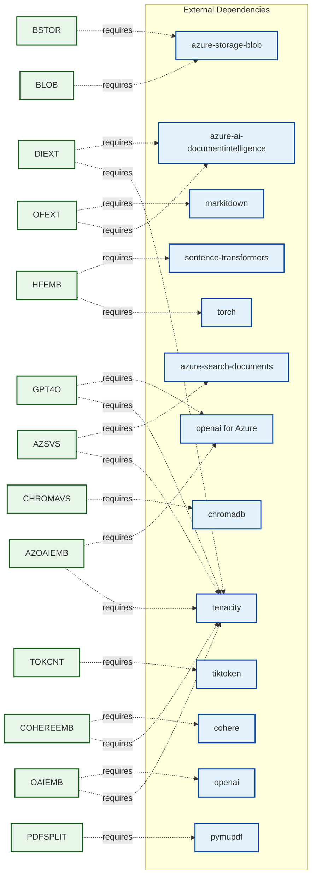
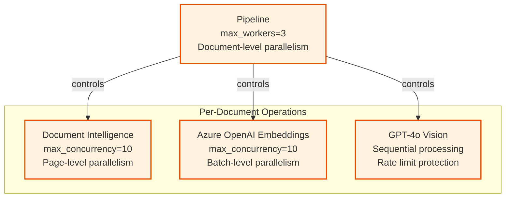
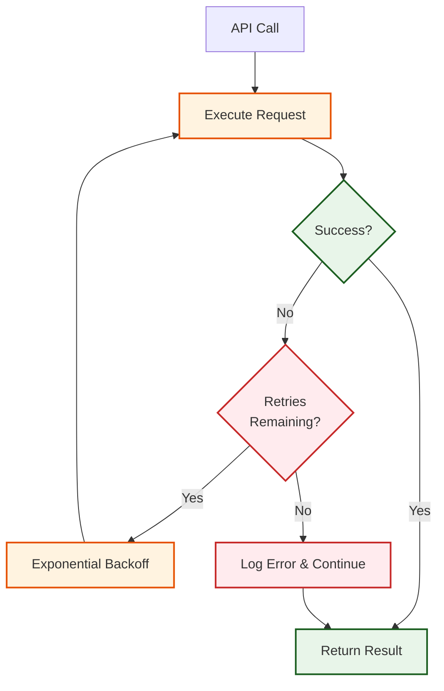
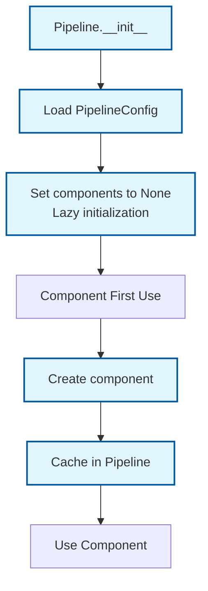

# Component Interactions

## Detailed Component Relationship Diagram

This diagram shows how components interact during document processing, including method calls, data flows, and dependencies.

```mermaid
graph TB
    subgraph "Pipeline Core"
        PIPELINE[Pipeline<br/>---<br/>+ run async<br/>+ _process_document async<br/>+ _upload_to_search async<br/>+ close async]
        CONFIG[PipelineConfig<br/>---<br/>+ from_env classmethod<br/>+ validate method<br/>+ nested dataclasses]
    end

    subgraph "Input Abstraction"
        ISRC[InputSource ABC<br/>---<br/>+ list_files async<br/>+ read_file async]
        LOCAL[LocalInputSource<br/>---<br/>glob patterns<br/>filesystem access]
        BLOB[BlobInputSource<br/>---<br/>container/prefix<br/>blob client]
    end

    subgraph "Extraction Components"
        DIEXT[DIExtractor<br/>---<br/>+ extract_pages async<br/>+ _extract_single_page async<br/>retry logic<br/>semaphore control]
        OFEXT[OfficeExtractor<br/>---<br/>+ extract_pages async<br/>mode: azure_di/markitdown/hybrid<br/>equation detection]
        MDCONV[MarkItDown<br/>---<br/>+ convert method<br/>offline processing<br/>all formats]
    end

    subgraph "Content Understanding"
        MEDESC[MediaDescriber ABC<br/>---<br/>+ describe_images async]
        GPT4O[GPT4oMediaDescriber<br/>---<br/>Azure OpenAI Vision<br/>description + OCR<br/>retry logic]
        NODESC[DisabledMediaDescriber<br/>---<br/>no-op implementation]
    end

    subgraph "Text Processing"
        CHUNK[LayoutAwareChunker<br/>---<br/>+ chunk_pages method<br/>token-based splitting<br/>table/figure preservation<br/>overlap support]
        TBLRND[TableRenderer<br/>---<br/>+ render_table static<br/>modes: plain/markdown/html<br/>span handling]
        TOKCNT[TokenCounter<br/>---<br/>+ count_tokens static<br/>tiktoken integration<br/>model-specific encoding]
    end

    subgraph "Embeddings Abstraction"
        EMBABS[EmbeddingsProvider ABC<br/>---<br/>+ generate_embedding async<br/>+ generate_embeddings_batch async<br/>+ get_dimensions<br/>+ get_model_name<br/>+ get_max_seq_length]
        AZOAIEMB[AzureOpenAIProvider<br/>---<br/>1536/3072 dims<br/>8191 tokens<br/>Azure OpenAI]
        HFEMB[HuggingFaceProvider<br/>---<br/>384-1024 dims<br/>local execution<br/>sentence-transformers]
        COHEREEMB[CohereProvider<br/>---<br/>1024 dims<br/>96 batch size<br/>multilingual v3]
        OAIEMB[OpenAIProvider<br/>---<br/>1536/3072 dims<br/>8191 tokens<br/>OpenAI API]
    end

    subgraph "Vector Store Abstraction"
        VSABS[VectorStore ABC<br/>---<br/>+ upload_documents async<br/>+ delete_documents_by_filename async<br/>+ delete_all_documents async<br/>+ search async<br/>+ get_dimensions]
        AZSVS[AzureSearchVectorStore<br/>---<br/>Azure AI Search<br/>integrated vectorization<br/>1000 doc batches]
        CHROMAVS[ChromaDBVectorStore<br/>---<br/>persistent/memory/client<br/>configurable batches<br/>metadata filtering]
    end

    subgraph "Storage Abstraction"
        ASTOR[ArtifactStorage ABC<br/>---<br/>+ upload_artifact async<br/>+ list_artifacts async]
        LSTOR[LocalArtifactStorage<br/>---<br/>filesystem paths<br/>directory creation]
        BSTOR[BlobArtifactStorage<br/>---<br/>container management<br/>blob client]
    end

    subgraph "Data Models"
        DOC[DocumentMetadata<br/>---<br/>sourcefile<br/>storage_url<br/>md5_hash]
        PAGE[PageMetadata<br/>---<br/>page_num<br/>sourcepage<br/>page_blob_url]
        CHUNK_META[ChunkMetadata<br/>---<br/>chunk_id<br/>text<br/>embedding<br/>token_count]
        EXTPAGE[ExtractedPage<br/>---<br/>page_num<br/>text<br/>tables: List<br/>images: List]
        CHUNK_DOC[ChunkDocument<br/>---<br/>document: DocMetadata<br/>page: PageMetadata<br/>chunk: ChunkMetadata<br/>tables: List<br/>figures: List]
    end

    subgraph "Utilities"
        PDFSPLIT[PagePdfSplitter<br/>---<br/>+ split_pdf_by_page async<br/>pypdf integration<br/>per-page output]
        INDEXMGR[IndexManager<br/>---<br/>+ create_index async<br/>+ delete_index async<br/>+ check_index async<br/>schema management]
        STATUS[PipelineStatus<br/>---<br/>total_documents<br/>successful_documents<br/>failed_documents<br/>results: List]
    end

    %% Configuration flow
    CONFIG -.provides config.-> PIPELINE
    CONFIG -.provides config.-> DIEXT
    CONFIG -.provides config.-> OFEXT
    CONFIG -.provides config.-> EMBED
    CONFIG -.provides config.-> SEARCH
    CONFIG -.provides config.-> CHUNK

    %% Pipeline orchestration
    PIPELINE -->|creates| ISRC
    ISRC -.implements.-> LOCAL
    ISRC -.implements.-> BLOB

    PIPELINE -->|creates| ASTOR
    ASTOR -.implements.-> LSTOR
    ASTOR -.implements.-> BSTOR

    %% Input processing
    LOCAL -->|yields| DOC
    BLOB -->|yields| DOC
    PIPELINE -->|receives| DOC

    %% Document extraction flow
    PIPELINE -->|calls extract_pages| DIEXT
    PIPELINE -->|calls extract_pages| OFEXT
    OFEXT -->|fallback mode| MDCONV
    OFEXT -->|azure_di mode| DIEXT

    DIEXT -->|returns| EXTPAGE
    OFEXT -->|returns| EXTPAGE
    MDCONV -->|returns| EXTPAGE

    %% Content understanding flow
    PIPELINE -->|calls describe_images| MEDESC
    MEDESC -.implements.-> GPT4O
    MEDESC -.implements.-> NODESC
    GPT4O -->|updates| EXTPAGE

    %% Table processing
    EXTPAGE -->|tables| TBLRND
    TBLRND -->|rendered_text| EXTPAGE

    %% Chunking flow
    EXTPAGE -->|list of pages| CHUNK
    CHUNK -->|uses| TOKCNT
    CHUNK -->|creates| CHUNK_DOC
    CHUNK_DOC -->|contains| DOC
    CHUNK_DOC -->|contains| PAGE
    CHUNK_DOC -->|contains| CHUNK_META

    %% Embeddings abstraction flow
    CHUNK_DOC -->|text| EMBABS
    EMBABS -.implements.-> AZOAIEMB
    EMBABS -.implements.-> HFEMB
    EMBABS -.implements.-> COHEREEMB
    EMBABS -.implements.-> OAIEMB
    EMBABS -->|updates embedding| CHUNK_META

    %% PDF splitting
    PIPELINE -->|calls split_pdf| PDFSPLIT
    PDFSPLIT -->|uploads| ASTOR
    PDFSPLIT -->|updates| PAGE

    %% Vector store abstraction flow
    CHUNK_DOC -->|batch| VSABS
    VSABS -.implements.-> AZSVS
    VSABS -.implements.-> CHROMAVS
    AZSVS -->|indexes| AZSR[(Azure AI Search)]
    CHROMAVS -->|stores| CHROMA[(ChromaDB)]

    %% Artifact storage
    PIPELINE -->|uploads docs| ASTOR
    PIPELINE -->|uploads images| ASTOR
    ASTOR -->|stores in| AZBP[(Azure Blob Storage)]

    %% Status tracking
    PIPELINE -->|creates| STATUS
    STATUS -->|saved to| ASTOR

    %% Index management
    PIPELINE -->|uses| INDEXMGR
    INDEXMGR -->|manages schema| AZSR

    %% Styling
    classDef core fill:#fff3e0,stroke:#e65100,stroke-width:2px
    classDef input fill:#e1f5ff,stroke:#01579b,stroke-width:2px
    classDef extract fill:#f3e5f5,stroke:#4a148c,stroke-width:2px
    classDef process fill:#e8f5e9,stroke:#1b5e20,stroke-width:2px
    classDef model fill:#fff9c4,stroke:#f57f17,stroke-width:2px
    classDef util fill:#fce4ec,stroke:#880e4f,stroke-width:2px
    classDef azure fill:#e3f2fd,stroke:#0d47a1,stroke-width:3px

    class PIPELINE,CONFIG core
    class ISRC,LOCAL,BLOB,ASTOR,LSTOR,BSTOR input
    class DIEXT,OFEXT,MDCONV extract
    class MEDESC,GPT4O,NODESC,CHUNK,TBLRND,TOKCNT,EMBED,SEARCH process
    class DOC,PAGE,CHUNK_META,EXTPAGE,CHUNK_DOC model
    class PDFSPLIT,INDEXMGR,STATUS util
    class AZSR,AZBP azure
```



## Component Dependencies

### Core Dependencies



## Interface Contracts

### InputSource Interface

```python
class InputSource(ABC):
    @abstractmethod
    async def list_files(self) -> List[str]:
        """List all files matching criteria"""

    @abstractmethod
    async def read_file(self, file_path: str) -> Tuple[str, bytes, str]:
        """Returns: (filename, content_bytes, source_url)"""
```

**Implementations:**
- `LocalInputSource`: Glob patterns on filesystem
- `BlobInputSource`: Azure Blob Storage container/prefix

### ArtifactStorage Interface

```python
class ArtifactStorage(ABC):
    @abstractmethod
    async def upload_artifact(self, artifact_path: str, data: bytes) -> str:
        """Upload artifact, returns storage URL"""

    @abstractmethod
    async def list_artifacts(self, prefix: str) -> List[str]:
        """List artifacts by prefix"""
```

**Implementations:**
- `LocalArtifactStorage`: Local filesystem
- `BlobArtifactStorage`: Azure Blob Storage

### MediaDescriber Interface

```python
class MediaDescriber(ABC):
    @abstractmethod
    async def describe_images(self, images: List[ExtractedImage], page_text: str) -> None:
        """Update image descriptions in-place"""
```

**Implementations:**
- `GPT4oMediaDescriber`: Azure OpenAI GPT-4o Vision
- `DisabledMediaDescriber`: No-op (skip descriptions)

### EmbeddingsProvider Interface

```python
class EmbeddingsProvider(ABC):
    @abstractmethod
    async def generate_embedding(self, text: str) -> list[float]:
        """Generate embedding for a single text"""

    @abstractmethod
    async def generate_embeddings_batch(self, texts: list[str]) -> list[list[float]]:
        """Generate embeddings for multiple texts in batch"""

    @abstractmethod
    def get_dimensions(self) -> int:
        """Get embedding vector dimensions"""

    @abstractmethod
    def get_model_name(self) -> str:
        """Get the model name/identifier"""

    def get_max_seq_length(self) -> int:
        """Get maximum sequence length (tokens) supported"""
```

**Implementations:**
- `AzureOpenAIProvider`: Azure OpenAI embeddings (ada-002, 3-small, 3-large)
- `HuggingFaceProvider`: Local sentence-transformers models
- `CohereProvider`: Cohere v3 multilingual embeddings
- `OpenAIProvider`: Native OpenAI API embeddings

### VectorStore Interface

```python
class VectorStore(ABC):
    @abstractmethod
    async def upload_documents(self, chunk_docs: list[ChunkDocument], include_embeddings: bool = True) -> int:
        """Upload documents to vector store"""

    @abstractmethod
    async def delete_documents_by_filename(self, filename: str) -> int:
        """Delete all documents associated with a filename"""

    @abstractmethod
    async def delete_all_documents(self) -> int:
        """Delete all documents from the vector store"""

    @abstractmethod
    async def search(self, query: str, top_k: int = 10, filters: Optional[dict] = None) -> list[dict]:
        """Search for similar documents"""

    @abstractmethod
    def get_dimensions(self) -> int:
        """Get expected embedding dimensions for this store"""
```

**Implementations:**
- `AzureSearchVectorStore`: Azure AI Search with integrated/client-side vectorization
- `ChromaDBVectorStore`: ChromaDB with persistent, in-memory, or client/server modes

## Data Transformation Pipeline


## Concurrency Control

### Semaphore Hierarchy



**Concurrency Strategy:**
1. **Document Level**: Process N documents in parallel (max_workers)
2. **Page Level**: Extract M pages concurrently (max_concurrency_di)
3. **Batch Level**: Generate embeddings for K batches concurrently (max_concurrency_openai)
4. **Image Level**: Sequential processing to avoid rate limits (GPT-4o)

## Error Handling Strategy

### Retry Logic



**Retry Configuration:**
- **Document Intelligence**: 3 retries, 5-30s backoff
- **Azure OpenAI Embeddings**: 3 retries, 15-60s backoff
- **GPT-4o Vision**: 3 retries, 1-20s backoff
- **Azure Search**: Built-in SDK retries

## Component Initialization Order



**Lazy Components:**
- Input Source (created on first `run()`)
- Artifact Storage (created on first upload)
- DI Extractor (created on first PDF/Office doc)
- Office Extractor (created on first Office doc)
- Media Describer (created on first image)
- Embeddings Provider (created on first chunk batch, auto-selected by factory)
- Vector Store (created on first upload, auto-selected by factory)

## Related Documentation
- [High-Level Architecture](01_HIGH_LEVEL_ARCHITECTURE.md) - System overview
- [Data Flow Diagram](03_DATA_FLOW.md) - End-to-end data flow
- [Sequence Diagrams](04_SEQUENCE_DOCUMENT_INGESTION.md) - Workflow details
