# Data Flow Diagram

## End-to-End Data Processing Flow

This diagram shows how data transforms as it flows through the Ingestor pipeline.

```mermaid
graph TB
    subgraph "INPUT STAGE"
        INPUT[Input Documents<br/>---<br/>PDF, DOCX, PPTX, TXT, MD<br/>HTML, JSON, CSV]
        GLOB[File Discovery<br/>---<br/>Glob patterns or<br/>Blob container listing]
    end

    subgraph "DOCUMENT STAGE"
        UPLOAD[Full Document Upload<br/>---<br/>Upload to blob storage<br/>Generate storage_url]
        SPLIT[PDF Page Splitting<br/>---<br/>Only for PDFs<br/>Create page-0001.pdf, etc.]
    end

    subgraph "EXTRACTION STAGE"
        DI[Azure Document Intelligence<br/>---<br/>Layout analysis<br/>Table extraction<br/>Figure detection]
        OFFICE[Office Extractor<br/>---<br/>DOCX/PPTX processing<br/>Hybrid or MarkItDown]
        TEXT[Text Extraction<br/>---<br/>Plain text files<br/>MD, HTML, JSON, CSV]
    end

    subgraph "PAGE DATA"
        PAGE[ExtractedPage Objects<br/>---<br/>page_num: 1<br/>text: "..."<br/>tables: List[ExtractedTable]<br/>images: List[ExtractedImage]]
    end

    subgraph "ENRICHMENT STAGE"
        TBL[Table Rendering<br/>---<br/>Convert tables to text<br/>Plain/Markdown/HTML<br/>Preserve spans]
        IMG[Image Description<br/>---<br/>GPT-4o Vision<br/>Generate descriptions<br/>Extract text from images]
    end

    subgraph "PAGE DATA ENRICHED"
        PAGE2[ExtractedPage with<br/>Rendered Content<br/>---<br/>tables[].rendered_text<br/>images[].description]
    end

    subgraph "CHUNKING STAGE"
        CHUNK[Layout-Aware Chunking<br/>---<br/>Token-based splitting<br/>Preserve tables atomically<br/>Add overlap for context]
    end

    subgraph "CHUNK DATA"
        CHUNKS[ChunkDocument Objects<br/>---<br/>chunk_id: "doc_p1_c1"<br/>text: "..."<br/>token_count: 450<br/>tables: List[TableReference]<br/>figures: List[FigureReference]]
    end

    subgraph "EMBEDDING STAGE"
        BATCH[Batch Formation<br/>---<br/>Group chunks<br/>Respect model token limit]
        EMBSEL[Select Embeddings Provider<br/>---<br/>Azure OpenAI / Hugging Face<br/>Cohere / OpenAI]
        EMBED[Generate Embeddings<br/>---<br/>384-3072 dimensions<br/>Concurrent/local processing]
    end

    subgraph "VECTOR DATA"
        VECTORS[ChunkDocument with Embeddings<br/>---<br/>embedding: [0.123, -0.456, ...]<br/>dimensions: 384-3072<br/>provider-specific]
    end

    subgraph "VECTOR STORE STAGE"
        VSSEL[Select Vector Store<br/>---<br/>Azure AI Search / ChromaDB]
        FORMAT[Format Documents<br/>---<br/>Convert to store format<br/>Include embeddings/metadata]
        BATCH2[Upload Batching<br/>---<br/>Store-specific batch sizes<br/>Merge-or-upload mode]
    end

    subgraph "OUTPUT"
        VSOUT[Vector Store<br/>---<br/>Azure AI Search: Cloud index<br/>ChromaDB: Local/remote DB<br/>Indexed chunks with<br/>metadata, embeddings,<br/>and blob URLs]
        ARTIFACTS[Artifact Storage<br/>---<br/>Full documents<br/>Per-page PDFs<br/>Extracted images<br/>Status files]
    end

    %% Flow connections
    INPUT --> GLOB
    GLOB --> UPLOAD
    UPLOAD --> SPLIT
    UPLOAD --> DI
    UPLOAD --> OFFICE
    UPLOAD --> TEXT

    SPLIT --> ARTIFACTS

    DI --> PAGE
    OFFICE --> PAGE
    TEXT --> PAGE

    PAGE --> TBL
    PAGE --> IMG
    TBL --> PAGE2
    IMG --> PAGE2

    PAGE2 --> CHUNK
    CHUNK --> CHUNKS

    CHUNKS --> BATCH
    BATCH --> EMBSEL
    EMBSEL --> EMBED
    EMBED --> VECTORS

    VECTORS --> VSSEL
    VSSEL --> FORMAT
    FORMAT --> BATCH2
    BATCH2 --> VSOUT

    UPLOAD --> ARTIFACTS
    SPLIT --> ARTIFACTS
    IMG --> ARTIFACTS

    %% Styling
    classDef input fill:#e1f5ff,stroke:#01579b,stroke-width:2px
    classDef doc fill:#fff3e0,stroke:#e65100,stroke-width:2px
    classDef extract fill:#f3e5f5,stroke:#4a148c,stroke-width:2px
    classDef data fill:#fff9c4,stroke:#f57f17,stroke-width:2px
    classDef process fill:#e8f5e9,stroke:#1b5e20,stroke-width:2px
    classDef output fill:#e3f2fd,stroke:#0d47a1,stroke-width:3px

    class INPUT,GLOB input
    class UPLOAD,SPLIT doc
    class DI,OFFICE,TEXT extract
    class PAGE,PAGE2,CHUNKS,VECTORS data
    class TBL,IMG,CHUNK,BATCH,EMBSEL,EMBED,VSSEL,FORMAT,BATCH2 process
    class VSOUT,ARTIFACTS output
```

## Data Transformation Details

### 1. Input Discovery

**Input Formats:**
```
Local Files:              Blob Storage:
├─ *.pdf                 ├─ container/docs/*.pdf
├─ *.docx                ├─ container/reports/*.docx
├─ *.pptx                └─ container/data/*.csv
├─ *.txt, *.md
├─ *.html
├─ *.json, *.csv
```

**Output:**
```python
(filename: str, content_bytes: bytes, source_url: str)
# Example:
("report.pdf", b"%PDF-1.4...", "file:///path/report.pdf")
```

### 2. Document Upload & Storage

**Full Document Upload:**
```python
storage_url = await artifact_storage.upload_artifact(
    artifact_path="documents/report.pdf",
    data=content_bytes
)
# storage_url = "https://account.blob.core.windows.net/container/documents/report.pdf"
```

**PDF Page Splitting (PDFs only):**
```python
page_urls = await split_pdf_by_page(
    pdf_bytes=content_bytes,
    filename="report.pdf"
)
# page_urls = [
#     "https://.../container/report/page-0001.pdf",
#     "https://.../container/report/page-0002.pdf",
# ]
```

### 3. Content Extraction

**Azure Document Intelligence Output:**
```python
ExtractedPage(
    page_num=1,
    text="This is page content...",
    tables=[
        ExtractedTable(
            caption="Table 1: Sales Data",
            rows=[[Cell("Q1"), Cell("$100K")], ...],
            rendered_text=None  # Will be filled later
        )
    ],
    images=[
        ExtractedImage(
            page_num=1,
            figure_id="figure_1",
            caption="Chart showing growth",
            image_bytes=b"\x89PNG...",
            bbox={"x": 100, "y": 200, "width": 400, "height": 300},
            description=None  # Will be filled later
        )
    ]
)
```

**Text File Extraction:**
```python
ExtractedPage(
    page_num=1,
    text="Full text content of file...",
    tables=[],  # No tables
    images=[]   # No images
)
```

### 4. Content Enrichment

**Table Rendering:**
```python
# BEFORE
table.rendered_text = None

# AFTER (Plain mode)
table.rendered_text = """
+------+--------+
| Q1   | $100K  |
| Q2   | $150K  |
+------+--------+
"""

# AFTER (Markdown mode)
table.rendered_text = """
| Q1 | $100K |
| Q2 | $150K |
"""
```

**Image Description:**
```python
# BEFORE
image.description = None

# AFTER (GPT-4o Vision)
image.description = "A line chart showing quarterly sales growth from Q1 to Q4, with an upward trend. The chart shows values: Q1: $100K, Q2: $150K, Q3: $180K, Q4: $220K."
```

### 5. Chunking

**Input:** List of ExtractedPage objects

**Process:**
1. Concatenate page text
2. Identify table/figure positions
3. Split text into token-based chunks
4. Preserve tables as atomic units
5. Add overlap between chunks
6. Create chunk metadata

**Output:**
```python
ChunkDocument(
    document=DocumentMetadata(
        sourcefile="report.pdf",
        storage_url="https://.../container/documents/report.pdf",
        md5_hash="abc123...",
        file_size=1024000
    ),
    page=PageMetadata(
        page_num=1,
        sourcepage="report/page-0001.pdf#page=1",
        page_blob_url="https://.../container/report/page-0001.pdf"
    ),
    chunk=ChunkMetadata(
        chunk_id="report_p1_c1",
        text="This is the chunk text with context...",
        token_count=485,
        embedding=None  # Will be filled later
    ),
    tables=[
        TableReference(
            table_id="table_1",
            rendered_text="...",
            included_in_chunk=True
        )
    ],
    figures=[
        FigureReference(
            figure_id="figure_1",
            description="...",
            figure_url="https://.../container/report/figure_1.png",
            included_in_chunk=True
        )
    ]
)
```

### 6. Embedding Generation

**Provider Selection:**
```python
# Auto-detected from configuration
embeddings_provider = create_embeddings_provider(config)
# Could be: AzureOpenAIProvider, HuggingFaceProvider, CohereProvider, OpenAIProvider
```

**Batch Formation:**
```python
# Group chunks respecting model-specific token limit
# Azure OpenAI / OpenAI: 8191 tokens
# Hugging Face (all-MiniLM-L6-v2): 256 tokens
# Hugging Face (jina-embeddings-v2-base-en): 8192 tokens
# Cohere v3: 512 tokens
batch_1 = [chunk1, chunk2, chunk3, ...]  # Total within limit
batch_2 = [chunk17, chunk18, ...]         # Total within limit
```

**Embeddings API Call:**
```python
# Request
texts = [chunk.chunk.text for chunk in batch]

# Response (dimensions vary by provider)
embeddings = [
    [0.123, -0.456, 0.789, ...],  # Azure OpenAI ada-002: 1536 dims
    [0.234, -0.567, 0.890, ...],  # Azure OpenAI 3-large: 3072 dims
    [0.345, -0.678, 0.901, ...],  # Hugging Face MiniLM: 384 dims
    [0.456, -0.789, 0.012, ...],  # Cohere v3: 1024 dims
]

# Update chunks
for chunk, embedding in zip(batch, embeddings):
    chunk.chunk.embedding = embedding
```

### 7. Vector Store Upload

**Vector Store Selection:**
```python
# Auto-detected from configuration
vector_store = create_vector_store(config, embeddings_provider)
# Could be: AzureSearchVectorStore, ChromaDBVectorStore
```

**Format for Vector Store:**

**Azure AI Search Document:**
```python
{
    "id": "report_p1_c1",
    "chunk_id": "report_p1_c1",
    "text": "This is the chunk text...",
    "embedding": [0.123, -0.456, ...],
    "token_count": 485,

    # Document metadata
    "sourcefile": "report.pdf",
    "storage_url": "https://.../container/documents/report.pdf",
    "md5_hash": "abc123...",
    "file_size": 1024000,

    # Page metadata
    "page_num": 1,
    "sourcepage": "report/page-0001.pdf#page=1",
    "storageUrl": "https://.../container/report/page-0001.pdf",

    # Tables (as JSON array)
    "tables": [
        {
            "table_id": "table_1",
            "rendered_text": "...",
            "included_in_chunk": true
        }
    ],

    # Figures (as JSON array)
    "figures": [
        {
            "figure_id": "figure_1",
            "description": "...",
            "figure_url": "https://.../container/report/figure_1.png",
            "included_in_chunk": true
        }
    ]
}
```

**ChromaDB Document:**
```python
{
    "id": "report_p1_c1",
    "document": "This is the chunk text...",
    "embedding": [0.123, -0.456, ...],
    "metadata": {
        "chunk_id": "report_p1_c1",
        "sourcefile": "report.pdf",
        "storage_url": "https://.../container/documents/report.pdf",
        "page_num": 1,
        "sourcepage": "report/page-0001.pdf#page=1",
        "storageUrl": "https://.../container/report/page-0001.pdf",
        "token_count": 485,
        # Note: ChromaDB filters out empty lists automatically
    }
}
```

### 8. Vector Store Upload

**Azure AI Search Upload:**
```python
# Batch 1: Chunks 1-1000
await vector_store.upload_documents(batch_1)

# Batch 2: Chunks 1001-2000
await vector_store.upload_documents(batch_2)
```

**Azure AI Search Index Schema:**
```json
{
  "name": "documents-index",
  "fields": [
    {"name": "id", "type": "Edm.String", "key": true},
    {"name": "chunk_id", "type": "Edm.String", "filterable": true},
    {"name": "text", "type": "Edm.String", "searchable": true},
    {"name": "embedding", "type": "Collection(Edm.Single)", "vectorSearchDimensions": "384-3072"},
    {"name": "sourcefile", "type": "Edm.String", "filterable": true},
    {"name": "storage_url", "type": "Edm.String"},
    {"name": "page_num", "type": "Edm.Int32", "filterable": true},
    {"name": "sourcepage", "type": "Edm.String"},
    {"name": "storageUrl", "type": "Edm.String"},
    {"name": "tables", "type": "Edm.String"},
    {"name": "figures", "type": "Edm.String"}
  ]
}
```

**ChromaDB Upload:**
```python
# Add documents to collection
await vector_store.upload_documents(chunks)
# ChromaDB handles batching internally
```

**ChromaDB Collection:**
```python
{
  "name": "documents-collection",
  "metadata": {
    "hnsw:space": "cosine",  # Distance metric
    "dimensionality": 384-3072  # Varies by embeddings provider
  }
}
```

## Data Size Metrics

### Typical Document Processing

**Input:**
- 10-page PDF document
- 5000 words total
- 3 tables, 5 figures

**After Extraction:**
- 10 ExtractedPage objects
- ~500 words per page
- 3 ExtractedTable objects with structure
- 5 ExtractedImage objects with bounding boxes

**After Enrichment:**
- Tables rendered to text: +200 words each = +600 words
- Images described: +50 words each = +250 words
- Total text: 5850 words (~7800 tokens)

**After Chunking:**
- Target chunk size: 500 tokens
- 7800 tokens / 500 = ~16 chunks
- With tables preserved: 18-20 chunks (tables in dedicated chunks)

**After Embedding:**
- 20 chunks × 1536 dimensions (ada-002) = 30,720 floats
- 20 chunks × 3072 dimensions (3-large) = 61,440 floats
- Memory: ~240KB - 480KB per document

**In Search Index:**
- 20 documents (chunks) indexed
- Each document: ~2-5KB (text + metadata + embedding)
- Total: 40-100KB per original document

## Data Flow Performance

### Processing Timeline (10-page PDF)

```mermaid
gantt
    title Document Processing Timeline
    dateFormat ss
    axisFormat %S

    section Upload
    Full document upload       :upload, 00, 3s
    PDF page splitting         :split, after upload, 2s

    section Extraction
    DI API calls (10 pages)    :extract, after split, 15s

    section Enrichment
    Table rendering (3 tables) :tables, after extract, 1s
    Image description (5 imgs) :images, after tables, 10s

    section Chunking
    Text chunking (20 chunks)  :chunk, after images, 2s

    section Embedding
    Batch embedding (2 batches):embed, after chunk, 5s

    section Index
    Search upload (1 batch)    :search, after embed, 2s
```



**Total Time:** ~40 seconds per document (with concurrency: ~15-20 seconds)

### Batch Processing (100 PDFs, max_workers=3)

```
Concurrent processing: 3 documents at a time
Time per document: 20 seconds (with parallelism)
Total time: 100 docs / 3 workers × 20s = ~667 seconds (~11 minutes)
```

### Bottlenecks

1. **Azure Document Intelligence**: 10-15s per document
   - Mitigation: Concurrent page extraction, use MarkItDown for simple docs

2. **GPT-4o Vision**: 2s per image (sequential)
   - Mitigation: Disable if descriptions not needed, batch multiple images

3. **Embedding Generation**: 1-2s per batch
   - Mitigation: Concurrent requests, larger batches

4. **Network Bandwidth**: Upload speed to Azure
   - Mitigation: Compress artifacts, use regional endpoints

## Related Documentation
- [High-Level Architecture](01_HIGH_LEVEL_ARCHITECTURE.md) - System components
- [Component Interactions](02_COMPONENT_INTERACTIONS.md) - Component relationships
- [Sequence Diagrams](04_SEQUENCE_DOCUMENT_INGESTION.md) - Workflow steps
- [Performance Tuning Guide](../guides/PERFORMANCE_TUNING.md) - Optimization strategies
