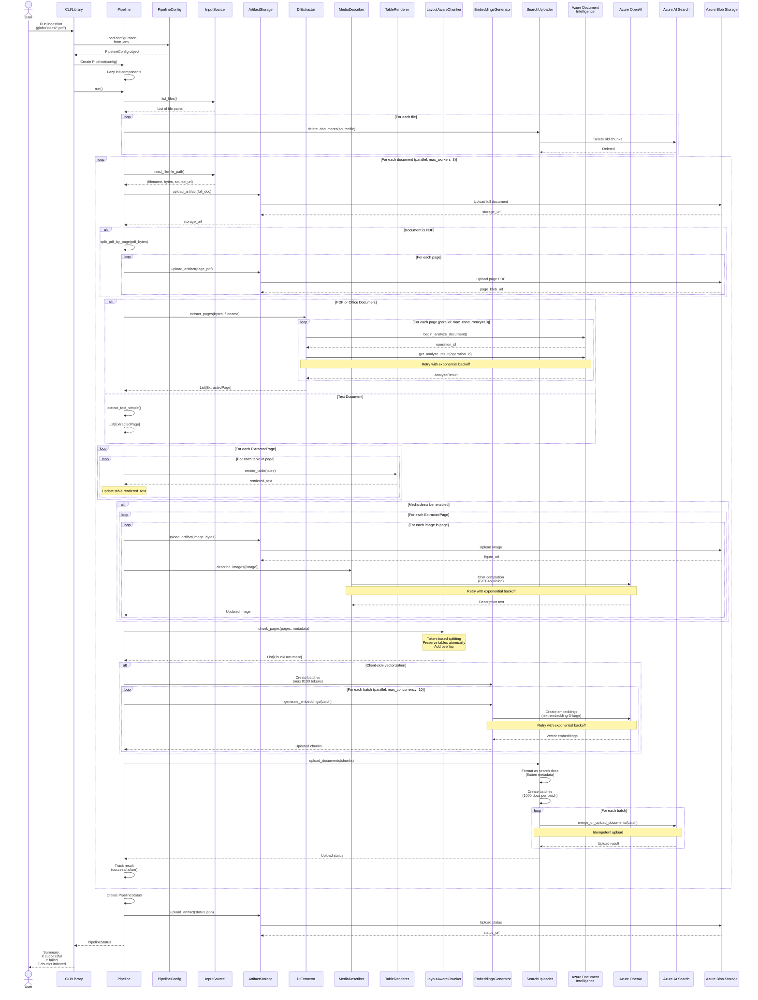

# Sequence Diagram: Document Ingestion (ADD Workflow)

## Complete Document Ingestion Flow

This sequence diagram shows the step-by-step flow of the ADD (document processing) workflow, from input to indexed chunks in Azure AI Search.



## Step-by-Step Breakdown

### Phase 1: Initialization (0-5 seconds)

```
1. User invokes CLI or library
2. Load configuration from .env or programmatic config
3. Validate Azure credentials and endpoints
4. Create Pipeline with lazy component initialization
5. List input files from source (local or blob)
```

**Key Operations:**
- `PipelineConfig.from_env()` - Load and validate config
- `InputSource.list_files()` - Discover documents to process

### Phase 2: Pre-Processing (5-10 seconds)

```
For each document:
1. Delete existing chunks from Azure Search (by sourcefile)
2. Optionally delete old blob artifacts (if enabled)
```

**Why Delete First:**
- Ensures clean re-indexing without duplicates
- Handles changed documents correctly
- Prevents orphaned chunks from previous versions

**Search Query:**
```python
await search_client.delete_documents(
    documents=[{"id": chunk_id} for chunk_id in existing_chunks]
)
```

### Phase 3: Document Upload (10-15 seconds per doc)

```
For each document:
1. Upload full document to blob storage
2. Store blob URL as storage_url (for document access)
3. If PDF: Split into per-page PDFs
4. Upload each page PDF to blob storage
5. Store page URLs for citation (sourcepage)
```

**Blob Structure:**
```
container/
├── documents/
│   └── report.pdf                  <- Full document
├── report/
│   ├── page-0001.pdf              <- Page 1
│   ├── page-0002.pdf              <- Page 2
│   └── page-0003.pdf              <- Page 3
```

### Phase 4: Content Extraction (15-30 seconds per doc)

#### For PDFs and Office Documents:

```
1. Call Azure Document Intelligence API
2. For each page (parallel processing):
   a. Send page to DI for analysis
   b. Poll for completion with retry logic
   c. Parse tables (with cell structure)
   d. Parse figures (with bounding boxes)
   e. Extract text with layout preservation
3. Return List[ExtractedPage]
```

**Document Intelligence API Flow:**
```
POST /documentintelligence/documentModels/prebuilt-layout:analyze
  └─> Returns: operation-location header

GET /documentintelligence/operations/{operationId}
  └─> Poll until status = "succeeded"
  └─> Returns: AnalyzeResult with pages, tables, figures
```

#### For Text Documents:

```
1. Decode bytes to UTF-8 text
2. Create single ExtractedPage
3. No tables or figures
```

**Extraction Output:**
```python
[
  ExtractedPage(
    page_num=1,
    text="Page content...",
    tables=[ExtractedTable(...)],
    images=[ExtractedImage(...)]
  ),
  ExtractedPage(page_num=2, ...),
]
```

### Phase 5: Table Rendering (30-32 seconds per doc)

```
For each ExtractedPage:
  For each table in page.tables:
    1. Choose rendering mode (plain/markdown/HTML)
    2. Convert table structure to text
    3. Handle cell spans (rowspan, colspan)
    4. Preserve table caption
    5. Store rendered_text in table object
```

**Rendering Example (Plain mode):**
```
Input:  ExtractedTable(rows=[[Cell("Q1"), Cell("$100K")]])
Output: table.rendered_text = """
+------+--------+
| Q1   | $100K  |
+------+--------+
"""
```

### Phase 6: Image Description (32-52 seconds per doc)

**Only if MediaDescriber enabled:**

```
For each ExtractedPage:
  For each image in page.images:
    1. Upload image to blob storage
    2. Get figure_url (blob URL for image)
    3. Call GPT-4o Vision API with image
    4. Request: description + OCR text extraction
    5. Store description in image object
```

**GPT-4o Vision Call:**
```python
messages = [
  {
    "role": "user",
    "content": [
      {"type": "text", "text": "Describe this image and extract any visible text."},
      {"type": "image_url", "image_url": {"url": f"data:image/png;base64,{b64_image}"}}
    ]
  }
]

response = await openai_client.chat.completions.create(
  model="gpt-4o",
  messages=messages
)

image.description = response.choices[0].message.content
```

**Why Sequential:**
- Prevents rate limiting (GPT-4o has stricter limits)
- Reduces parallel API costs

### Phase 7: Chunking (52-54 seconds per doc)

```
1. Combine all ExtractedPage objects
2. For each page:
   a. Start with page text
   b. Identify table positions
   c. Identify figure positions
3. Split text into chunks:
   a. Target: 500 tokens (configurable)
   b. Respect table boundaries (keep tables whole)
   c. Add overlap (10% default) between chunks
   d. Create ChunkDocument objects with metadata
4. Assign chunk IDs: "{sourcefile}_p{page}_c{chunk}"
5. Track table/figure references in each chunk
```

**Chunking Logic:**
```python
# Example chunk
ChunkDocument(
  document=DocumentMetadata(
    sourcefile="report.pdf",
    storage_url="https://.../documents/report.pdf"
  ),
  page=PageMetadata(
    page_num=1,
    sourcepage="report/page-0001.pdf#page=1",
    page_blob_url="https://.../report/page-0001.pdf"
  ),
  chunk=ChunkMetadata(
    chunk_id="report_p1_c1",
    text="This is the chunk text...",
    token_count=485
  ),
  tables=[TableReference(table_id="table_1", ...)],
  figures=[FigureReference(figure_id="figure_1", ...)]
)
```

### Phase 8: Embedding Generation (54-59 seconds per doc)

**Only if client-side vectorization:**

```
1. Group chunks into batches:
   - Respect 8100 token limit per batch
   - Typical batch: 10-16 chunks
2. For each batch (parallel processing):
   a. Extract text from chunks
   b. Call Azure OpenAI Embeddings API
   c. Receive vector embeddings
   d. Update chunk.embedding field
3. Dimensions based on model:
   - ada-002: 1536 dims
   - text-embedding-3-small: 1536 dims
   - text-embedding-3-large: 3072 dims (can set custom)
```

**Embedding API Call:**
```python
response = await openai_client.embeddings.create(
  model="text-embedding-3-large",
  input=[chunk.chunk.text for chunk in batch],
  dimensions=1024  # Optional: reduce dimensions
)

for i, chunk in enumerate(batch):
  chunk.chunk.embedding = response.data[i].embedding
```

### Phase 9: Search Upload (59-61 seconds per doc)

```
1. Convert ChunkDocument to search document format:
   a. Flatten nested metadata
   b. Combine document + page + chunk fields
   c. Serialize tables/figures as JSON strings
2. Create upload batches (1000 documents max):
3. For each batch:
   a. Call merge_or_upload_documents (idempotent)
   b. Handle upload errors with retry
4. Track upload statistics
```

**Search Document Format:**
```python
{
  "id": "report_p1_c1",
  "chunk_id": "report_p1_c1",
  "text": "This is the chunk text...",
  "embedding": [0.123, -0.456, ...],  # 1024-3072 floats
  "sourcefile": "report.pdf",
  "storage_url": "https://.../documents/report.pdf",
  "page_num": 1,
  "sourcepage": "report/page-0001.pdf#page=1",
  "storageUrl": "https://.../report/page-0001.pdf",
  "tables": "[{\"table_id\": \"table_1\", ...}]",
  "figures": "[{\"figure_id\": \"figure_1\", ...}]"
}
```

**Upload Mode:**
- `merge_or_upload_documents`: Idempotent
  - If document exists: merge fields
  - If document doesn't exist: upload new
- Prevents duplicates on retry

### Phase 10: Finalization (61-62 seconds per doc)

```
1. Track processing result:
   - Success: Document indexed successfully
   - Failure: Log error message
2. After all documents:
   a. Create PipelineStatus summary
   b. Save status.json to artifact storage
   c. Return status to user
```

**PipelineStatus:**
```python
PipelineStatus(
  total_documents=10,
  successful_documents=9,
  failed_documents=1,
  total_chunks_indexed=180,
  results=[
    IngestionResult(filename="report1.pdf", success=True, chunks=20),
    IngestionResult(filename="report2.pdf", success=True, chunks=18),
    ...
    IngestionResult(filename="report10.pdf", success=False, error_message="DI API timeout")
  ]
)
```

## Error Handling at Each Phase

### Extraction Errors

```
Error: Azure Document Intelligence timeout
Action: Retry with exponential backoff (3 attempts)
Fallback: If all retries fail, skip document and continue
```

### Embedding Errors

```
Error: Azure OpenAI rate limit exceeded
Action: Exponential backoff (15s, 30s, 60s)
Fallback: If batch fails, retry entire batch
```

### Search Upload Errors

```
Error: Network timeout during upload
Action: Retry with exponential backoff
Fallback: If batch fails after retries, mark document as failed
```

## Parallel Processing

### Document-Level Parallelism

```
max_workers = 3

Document 1 (Thread 1): [===== Processing =====]
Document 2 (Thread 2):     [===== Processing =====]
Document 3 (Thread 3):         [===== Processing =====]
Document 4 (Queued):                 [===== Processing =====]
```

### Page-Level Parallelism (within Document)

```
max_concurrency_di = 10

Page 1: [== DI API ==]
Page 2: [== DI API ==]
Page 3: [== DI API ==]
...
Page 10: [== DI API ==]
```

### Batch-Level Parallelism (Embeddings)

```
max_concurrency_openai = 10

Batch 1: [== Embeddings ==]
Batch 2: [== Embeddings ==]
Batch 3: [== Embeddings ==]
```

## Related Documentation
- [Document Removal Sequence](05_SEQUENCE_DOCUMENT_REMOVAL.md) - REMOVE workflow
- [Index Management Sequence](06_SEQUENCE_INDEX_MANAGEMENT.md) - Index operations
- [Data Flow Diagram](03_DATA_FLOW.md) - Data transformations
- [Performance Tuning](../guides/PERFORMANCE_TUNING.md) - Optimization strategies
