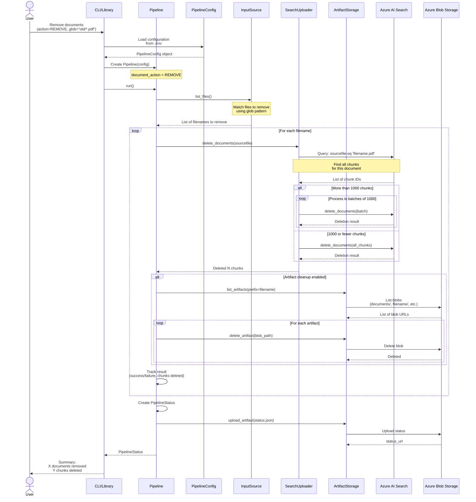

# Sequence Diagram: Document Removal (REMOVE Workflow)

## Document Deletion Flow

This sequence diagram shows the step-by-step flow of the REMOVE workflow, which deletes specific documents from the Azure AI Search index.



## REMOVE Workflow Breakdown

### Phase 1: Initialization (0-2 seconds)

```
1. User specifies --action remove with glob pattern
2. Load configuration (same as ADD workflow)
3. Create Pipeline with document_action=REMOVE
4. List files to remove from input source
```

**CLI Usage:**
```bash
# Remove specific document
ingestor --action remove --pdf "old_document.pdf"

# Remove multiple documents matching pattern
ingestor --action remove --glob "archive/*.pdf"

# Remove with artifact cleanup
ingestor --action remove --glob "*.pdf" --cleanup-artifacts
```

**Library Usage:**
```python
from ingestor import Pipeline, create_config
from ingestor.config import DocumentAction

config = create_config(
    input_glob="archive/*.pdf",
    document_action=DocumentAction.REMOVE,
)

pipeline = Pipeline(config)
status = await pipeline.run()
print(f"Deleted {status.total_chunks_indexed} chunks")  # Note: reused field
```

### Phase 2: Find Documents (2-3 seconds)

```
1. Use InputSource to match files:
   - LocalInputSource: Glob pattern on filesystem
   - BlobInputSource: Prefix match in container
2. Extract filenames (not full paths)
3. List becomes deletion targets
```

**Example:**
```python
# Input glob: "archive/*.pdf"
# Matched files:
[
  "archive/old_report.pdf",
  "archive/deprecated_doc.pdf"
]

# Extract filenames:
filenames = ["old_report.pdf", "deprecated_doc.pdf"]
```

### Phase 3: Query Existing Chunks (3-5 seconds per document)

```
For each filename:
1. Build search query: sourcefile eq 'filename.pdf'
2. Execute search to find all chunks
3. Extract chunk IDs from results
4. Prepare for deletion
```

**Search Query:**
```python
from azure.search.documents import SearchClient

search_client = SearchClient(...)

# Query all chunks for this document
results = search_client.search(
    search_text="*",
    filter=f"sourcefile eq '{filename}'",
    select=["id", "chunk_id"],
    top=1000  # Max per request
)

chunk_ids = [doc["id"] for doc in results]
```

**Pagination Handling:**
```python
# If more than 1000 chunks, need to paginate
all_chunk_ids = []
skip = 0

while True:
    results = search_client.search(
        search_text="*",
        filter=f"sourcefile eq '{filename}'",
        select=["id"],
        top=1000,
        skip=skip
    )

    batch = [doc["id"] for doc in results]
    if not batch:
        break

    all_chunk_ids.extend(batch)
    skip += 1000
```

### Phase 4: Delete Chunks (5-10 seconds per document)

```
1. Group chunk IDs into batches (1000 max per batch)
2. For each batch:
   a. Create delete documents list
   b. Call delete_documents API
   c. Handle errors with retry
3. Track total chunks deleted
```

**Delete Operation:**
```python
# Batch deletion
batch_size = 1000
for i in range(0, len(chunk_ids), batch_size):
    batch = chunk_ids[i:i+batch_size]

    delete_docs = [{"id": chunk_id} for chunk_id in batch]

    result = await search_client.delete_documents(documents=delete_docs)

    # Check result
    for item in result:
        if not item.succeeded:
            logger.warning(f"Failed to delete chunk {item.key}: {item.error_message}")
```

**Why Batching:**
- Azure Search limits: 1000 documents per batch
- Network efficiency: Fewer API calls
- Error isolation: Partial batch failures don't block others

### Phase 5: Artifact Cleanup (Optional, 10-15 seconds per document)

**Only if cleanup enabled in config:**

```
1. List all blob artifacts for document:
   - Full document: documents/{filename}
   - Per-page PDFs: {filename_stem}/page-*.pdf
   - Extracted images: {filename_stem}/figure_*.png
   - Page JSON: {filename_stem}/page-*.json
   - Manifest: {filename_stem}/manifest.json

2. For each artifact:
   a. Delete from blob storage
   b. Log deletion
   c. Handle errors (non-fatal)

3. Track artifacts deleted
```

**Blob Deletion:**
```python
from azure.storage.blob import BlobServiceClient

blob_service = BlobServiceClient(...)
container_client = blob_service.get_container_client("artifacts")

# List all blobs with prefix
filename_stem = "old_report"  # Without .pdf
prefixes = [
    f"documents/{filename}",      # Full document
    f"{filename_stem}/",          # All derived artifacts
]

for prefix in prefixes:
    blobs = container_client.list_blobs(name_starts_with=prefix)

    for blob in blobs:
        try:
            container_client.delete_blob(blob.name)
            logger.info(f"Deleted artifact: {blob.name}")
        except Exception as e:
            logger.warning(f"Failed to delete {blob.name}: {e}")
```

**Artifact Structure:**
```
container/
├── documents/
│   └── old_report.pdf              <- DELETE
├── old_report/
│   ├── page-0001.pdf              <- DELETE
│   ├── page-0002.pdf              <- DELETE
│   ├── page-0001.json             <- DELETE
│   ├── page-0002.json             <- DELETE
│   ├── figure_1.png               <- DELETE
│   ├── figure_2.png               <- DELETE
│   └── manifest.json              <- DELETE
```

### Phase 6: Status Reporting (15-17 seconds)

```
1. Create PipelineStatus summary:
   - total_documents: Number of files processed
   - successful_documents: Successfully deleted
   - failed_documents: Deletion failures
   - total_chunks_indexed: Total chunks deleted (reused field)

2. Create IngestionResult for each file:
   - filename
   - success status
   - chunks deleted count
   - error_message (if failed)

3. Save status to artifact storage
4. Return status to user
```

**Status Example:**
```python
PipelineStatus(
    total_documents=2,
    successful_documents=2,
    failed_documents=0,
    total_chunks_indexed=45,  # Total chunks deleted
    results=[
        IngestionResult(
            filename="old_report.pdf",
            success=True,
            chunks=20,
            error_message=None
        ),
        IngestionResult(
            filename="deprecated_doc.pdf",
            success=True,
            chunks=25,
            error_message=None
        )
    ]
)
```

## Error Handling

### Document Not Found in Index

```
Scenario: User tries to remove "missing.pdf" but it's not indexed

Flow:
1. Query search: sourcefile eq 'missing.pdf'
2. No results found
3. Result: No chunks to delete, success=True, chunks=0

Status: Not an error (idempotent operation)
```

### Partial Deletion Failure

```
Scenario: Document has 1500 chunks, first batch succeeds, second fails

Flow:
1. Delete first 1000 chunks: SUCCESS
2. Delete remaining 500 chunks: FAILURE (network error)
3. Result: Partial deletion, 1000 chunks removed

Status: Mark as failed, include error message
User Action: Retry removal to clean up remaining chunks
```

### Blob Deletion Failure

```
Scenario: Artifact cleanup enabled but blob access denied

Flow:
1. Delete chunks from search: SUCCESS
2. Attempt blob deletion: FAILURE (403 Forbidden)
3. Result: Chunks deleted, artifacts remain

Status: Log warning, continue processing (non-fatal)
Note: Orphaned artifacts won't affect search functionality
```

## REMOVE vs REMOVE_ALL

### REMOVE (This Workflow)

```
Purpose: Delete specific documents by filename
Use Case: Remove outdated or incorrect documents
Safety: Targeted deletion
Confirmation: None required (reversible by re-ingesting)

Example:
ingestor --action remove --glob "old/*.pdf"
```

### REMOVE_ALL (Separate Workflow)

```
Purpose: Delete ALL documents from index
Use Case: Reset index before bulk re-ingestion
Safety: DESTRUCTIVE (deletes everything)
Confirmation: Required (user must confirm)

Example:
ingestor --action removeall
> Are you sure you want to delete ALL documents? (y/N): y
```

**See:** [Index Management Sequence](06_SEQUENCE_INDEX_MANAGEMENT.md) for REMOVE_ALL details

## Performance Characteristics

### Deletion Speed

| Documents | Chunks per Doc | Total Chunks | Time (approx) |
|-----------|----------------|--------------|---------------|
| 1 | 20 | 20 | 2-3 seconds |
| 10 | 20 | 200 | 5-8 seconds |
| 100 | 20 | 2,000 | 30-45 seconds |
| 100 | 100 | 10,000 | 2-3 minutes |

**Factors:**
- Query speed: ~0.5-1s per query
- Deletion speed: ~0.5-1s per 1000 chunks
- Artifact cleanup: +5-10s per document (if enabled)

### Comparison with ADD

| Operation | Time per Document | Bottleneck |
|-----------|-------------------|------------|
| **ADD** | 20-60 seconds | Extraction, embeddings |
| **REMOVE** | 2-5 seconds | Search query |

**Why REMOVE is faster:**
- No extraction or processing
- No embedding generation
- Simple query + delete operations
- Minimal data transfer

## Configuration Options

### Enable/Disable Artifact Cleanup

```bash
# Environment variable
CLEANUP_ARTIFACTS=true

# Programmatic
config = create_config(
    document_action=DocumentAction.REMOVE,
    cleanup_artifacts=True  # Delete blob artifacts
)
```

### Deletion Safety

```python
# Dry-run mode (future enhancement)
config = create_config(
    document_action=DocumentAction.REMOVE,
    dry_run=True  # Log what would be deleted, don't actually delete
)

status = await pipeline.run()
print(f"Would delete {status.total_chunks_indexed} chunks")
```

## Best Practices

### 1. Verify Before Deletion

```bash
# First: Check what will be deleted
ingestor --check-index --filter "sourcefile eq 'old_report.pdf'"

# Then: Proceed with deletion
ingestor --action remove --pdf "old_report.pdf"
```

### 2. Backup Before Bulk Deletion

```bash
# Export index data (if backup needed)
# Use Azure Search portal or API to export

# Then proceed with removal
ingestor --action remove --glob "archive/**/*.pdf"
```

### 3. Re-ingest Instead of Update

```
Pattern: Remove then Add (not update in place)

Why:
- Ensures clean state (no orphaned chunks)
- Handles document structure changes
- Recomputes embeddings for accuracy

Flow:
1. ingestor --action remove --pdf "document.pdf"
2. ingestor --action add --pdf "document.pdf"  # Updated version
```

### 4. Artifact Cleanup Strategy

```
Development/Testing:
- Enable cleanup to save storage costs
- Config: cleanup_artifacts=True

Production:
- Consider keeping artifacts for audit/debugging
- Config: cleanup_artifacts=False
- Implement periodic cleanup jobs if needed
```

## Related Documentation
- [Document Ingestion Sequence](04_SEQUENCE_DOCUMENT_INGESTION.md) - ADD workflow
- [Index Management Sequence](06_SEQUENCE_INDEX_MANAGEMENT.md) - REMOVE_ALL and index operations
- [Search Uploader Reference](../reference/17_SEARCH_UPLOADER.md) - Deletion implementation
- [Configuration Guide](../guides/CONFIGURATION.md) - Removal settings
