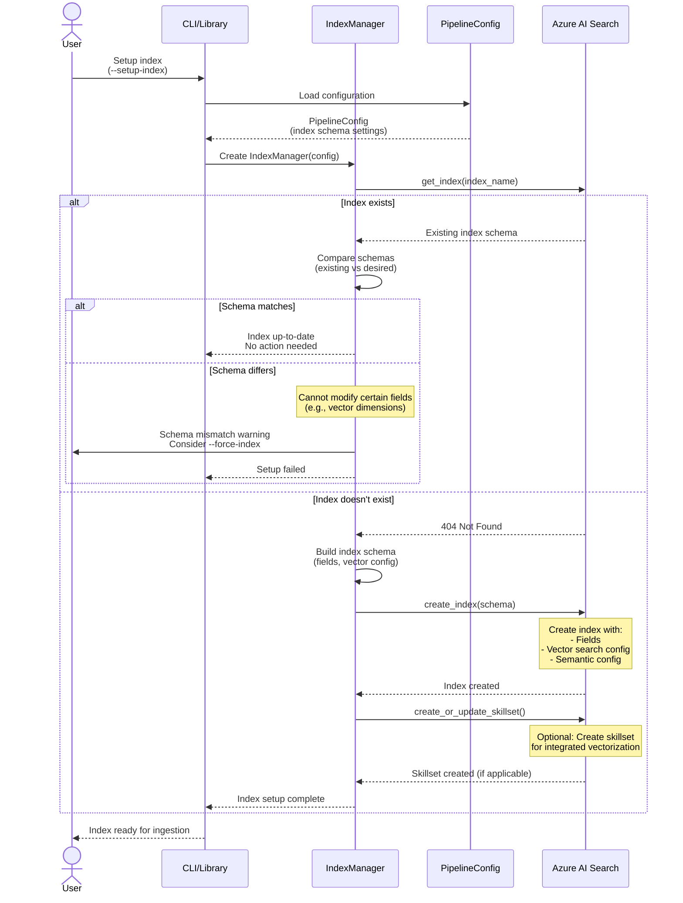
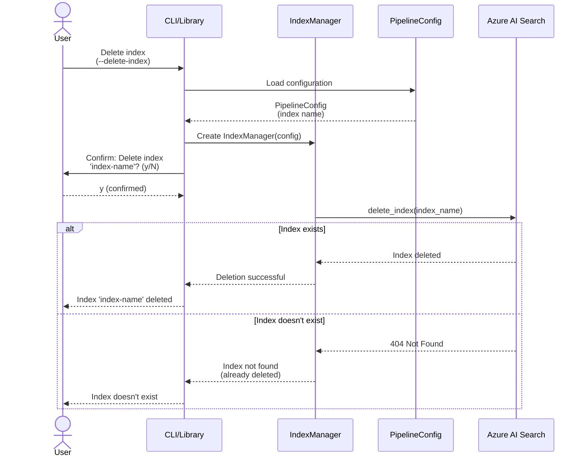
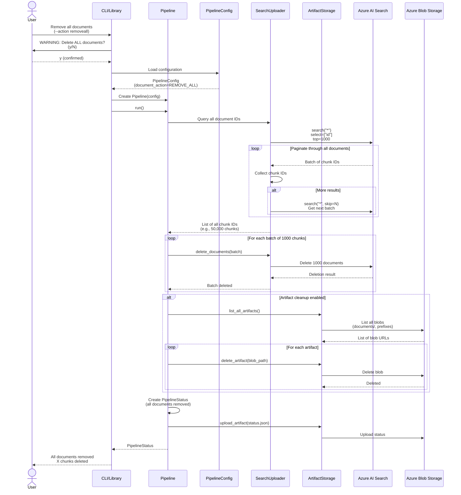
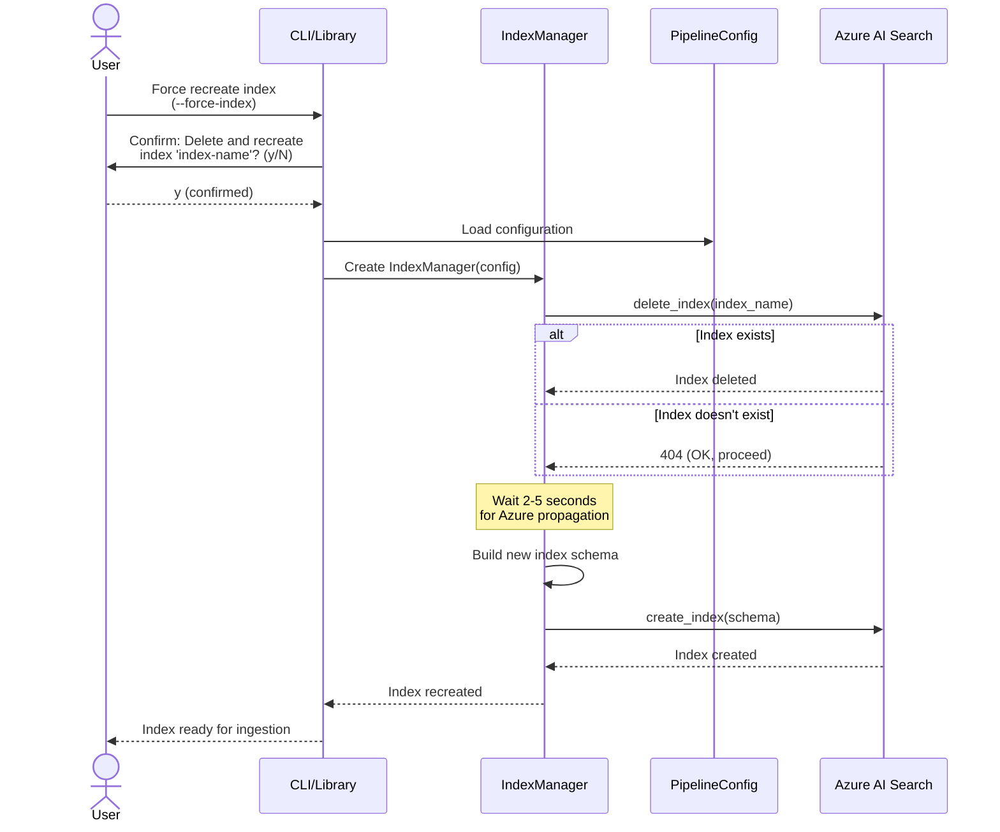

# Sequence Diagram: Index Management

## Index Setup, Deletion, and REMOVE_ALL Operations

This document contains sequence diagrams for Azure AI Search index management operations.

## 1. Index Setup (CREATE/UPDATE)



### Index Setup Breakdown

#### Phase 1: Schema Definition

```python
# From PipelineConfig
index_config = {
    "name": config.search.index_name,
    "fields": [
        # Key field
        {"name": "id", "type": "Edm.String", "key": True},

        # Chunk fields
        {"name": "chunk_id", "type": "Edm.String", "filterable": True},
        {"name": "text", "type": "Edm.String", "searchable": True},
        {"name": "token_count", "type": "Edm.Int32", "filterable": True},

        # Vector field
        {
            "name": "embedding",
            "type": "Collection(Edm.Single)",
            "vectorSearchDimensions": config.azure_openai.dimensions,  # 1024-3072
            "vectorSearchProfile": "default-vector-profile"
        },

        # Document metadata
        {"name": "sourcefile", "type": "Edm.String", "filterable": True, "facetable": True},
        {"name": "storage_url", "type": "Edm.String"},
        {"name": "md5_hash", "type": "Edm.String"},
        {"name": "file_size", "type": "Edm.Int64"},

        # Page metadata
        {"name": "page_num", "type": "Edm.Int32", "filterable": True},
        {"name": "sourcepage", "type": "Edm.String"},
        {"name": "storageUrl", "type": "Edm.String"},  # Per-page URL

        # Content references
        {"name": "tables", "type": "Edm.String"},   # JSON array
        {"name": "figures", "type": "Edm.String"},  # JSON array
    ],

    # Vector search configuration
    "vectorSearch": {
        "algorithms": [
            {
                "name": "default-algorithm",
                "kind": "hnsw",
                "hnswParameters": {
                    "metric": "cosine",
                    "m": 4,
                    "efConstruction": 400,
                    "efSearch": 500
                }
            }
        ],
        "profiles": [
            {
                "name": "default-vector-profile",
                "algorithm": "default-algorithm"
            }
        ]
    },

    # Semantic configuration (optional)
    "semanticSearch": {
        "configurations": [
            {
                "name": "default",
                "prioritizedFields": {
                    "titleField": {"fieldName": "sourcepage"},
                    "contentFields": [{"fieldName": "text"}],
                    "keywordsFields": [{"fieldName": "sourcefile"}]
                }
            }
        ]
    }
}
```

#### Phase 2: Schema Validation

```
1. Check if index exists
2. If exists:
   a. Get current schema
   b. Compare field types, vector dimensions
   c. Warn if incompatible (cannot update certain fields)
   d. Abort if mismatch (use --force-index to recreate)
3. If doesn't exist:
   a. Proceed to creation
```

**Immutable Fields:**
- Vector field dimensions (cannot change after creation)
- Field types (String, Int, etc.)
- Field key status

**Can Update:**
- Searchable, filterable, facetable flags
- Analyzers
- Scoring profiles

#### Phase 3: Index Creation

```bash
# CLI: Setup index only (no ingestion)
ingestor --setup-index --index-only

# CLI: Setup index and ingest documents
ingestor --setup-index --glob "docs/*.pdf"

# Library
from ingestor import create_index

await create_index(config)  # Create index
await run_pipeline(config)  # Then ingest
```

**Creation Steps:**
1. Create index with schema
2. Create vector search configuration
3. Create semantic configuration (if enabled)
4. Create skillset (if integrated vectorization)
5. Verify index accessibility

## 2. Index Deletion



### Index Deletion Breakdown

#### Deletion Workflow

```bash
# CLI: Delete index with confirmation
$ ingestor --delete-index
> Are you sure you want to delete index 'documents-index'? (y/N): y
> Index deleted successfully

# CLI: Force deletion (skip confirmation)
$ ingestor --delete-index --yes
> Index deleted successfully

# Library
from ingestor import delete_index

await delete_index(config)  # Requires interactive confirmation

# Force deletion
await delete_index(config, confirm=True)
```

**Safety Mechanisms:**
- Interactive confirmation required (CLI)
- Clear index name display
- Idempotent (succeeds if index doesn't exist)
- Logs deletion for audit

#### What Gets Deleted

```
Index Deletion:
✓ All indexed documents (chunks)
✓ Index schema and configuration
✓ Vector search configuration
✓ Semantic configuration
✗ Blob storage artifacts (not deleted)
✗ Source documents (not deleted)
```

**Note:** Artifact cleanup is separate. Use `--cleanup-artifacts` with `--action removeall` to clean blobs.

## 3. REMOVE_ALL (Clear All Documents)



### REMOVE_ALL Breakdown

#### Initialization

```bash
# CLI: Remove all documents
$ ingestor --action removeall
> WARNING: This will delete ALL documents from index 'documents-index'.
> This operation cannot be undone.
> Are you sure? (y/N): y
> Deleting all documents...

# CLI: Force removal (skip confirmation)
$ ingestor --action removeall --yes

# Library
from ingestor import Pipeline, create_config
from ingestor.config import DocumentAction

config = create_config(
    document_action=DocumentAction.REMOVE_ALL,
)

pipeline = Pipeline(config)
# Note: Confirmation required in interactive mode
status = await pipeline.run()
```

#### Query All Document IDs

```python
# SearchUploader implementation
async def get_all_document_ids(self) -> List[str]:
    """Query all document IDs from index"""
    all_ids = []
    skip = 0
    batch_size = 1000

    while True:
        results = await self.search_client.search(
            search_text="*",
            select=["id"],
            top=batch_size,
            skip=skip
        )

        batch = [doc["id"] async for doc in results]
        if not batch:
            break

        all_ids.extend(batch)
        skip += batch_size

        logger.info(f"Collected {len(all_ids)} document IDs so far...")

    return all_ids
```

**Performance:**
- Query speed: ~0.5-1s per 1000 documents
- 10,000 documents: ~5-10 seconds to query
- 100,000 documents: ~50-100 seconds to query

#### Batch Deletion

```python
# Delete in batches of 1000
batch_size = 1000
for i in range(0, len(all_ids), batch_size):
    batch = all_ids[i:i+batch_size]

    delete_docs = [{"id": doc_id} for doc_id in batch]

    result = await search_client.delete_documents(documents=delete_docs)

    success_count = sum(1 for item in result if item.succeeded)
    logger.info(f"Deleted batch {i//batch_size + 1}: {success_count}/{len(batch)} succeeded")
```

**Performance:**
- Deletion speed: ~0.5-1s per 1000 documents
- 10,000 documents: ~5-10 seconds to delete
- 100,000 documents: ~50-100 seconds to delete

#### Artifact Cleanup (Optional)

```python
# If cleanup_artifacts=True
if config.cleanup_artifacts:
    # List all blob prefixes
    prefixes = ["documents/"]  # Full documents

    # Get unique filename stems from deleted docs
    filename_stems = set()
    for doc_id in all_ids:
        # Extract filename from chunk_id: "report_p1_c1" -> "report"
        stem = doc_id.split("_p")[0]
        filename_stems.add(stem)

    # Add derived artifact prefixes
    prefixes.extend([f"{stem}/" for stem in filename_stems])

    # Delete all blobs
    for prefix in prefixes:
        blobs = container_client.list_blobs(name_starts_with=prefix)
        for blob in blobs:
            await container_client.delete_blob(blob.name)
            logger.info(f"Deleted artifact: {blob.name}")
```

**Cleanup Time:**
- Depends on artifact count
- ~0.1-0.5s per blob
- 1000 artifacts: ~2-8 minutes

### REMOVE_ALL vs Index Deletion

| Operation | Index Schema | Documents | Artifacts | Recovery |
|-----------|--------------|-----------|-----------|----------|
| **REMOVE_ALL** | Preserved | Deleted | Optional cleanup | Re-ingest documents |
| **Index Deletion** | Deleted | Deleted | Not affected | Recreate index + re-ingest |

**When to use REMOVE_ALL:**
- Reset index before bulk re-ingestion
- Clear index while preserving schema
- Faster than delete+recreate index

**When to use Index Deletion:**
- Change index schema (field types, vector dimensions)
- Completely start over
- Decommission index

## 4. Force Index Recreation



### Force Recreation Use Cases

#### Schema Changes

```bash
# Scenario: Change vector dimensions from 1536 to 1024
# 1. Update .env
AZURE_OPENAI_DIMENSIONS=1024

# 2. Force recreate index
$ ingestor --force-index
> WARNING: This will delete index 'documents-index' and recreate it.
> All existing documents will be lost.
> Are you sure? (y/N): y
> Index deleted
> Index created with new schema
> Ready for ingestion

# 3. Re-ingest documents
$ ingestor --glob "docs/**/*.pdf"
```

#### Fix Schema Mismatches

```bash
# Scenario: Index created with old schema version
$ ingestor --setup-index
> ERROR: Schema mismatch detected
> Expected: embedding dimensions 1024
> Current: embedding dimensions 1536
> Use --force-index to recreate

$ ingestor --force-index
> Index recreated with correct schema
```

## Index Management Best Practices

### 1. Development Workflow

```bash
# Initial setup
ingestor --setup-index --index-only

# Ingest test data
ingestor --glob "test_docs/*.pdf"

# Iterate: Clear and re-ingest
ingestor --action removeall --yes
ingestor --glob "test_docs/*.pdf"

# Schema change: Force recreate
ingestor --force-index
ingestor --glob "test_docs/*.pdf"
```

### 2. Production Deployment

```bash
# Step 1: Create index
ingestor --setup-index --index-only

# Step 2: Validate schema
ingestor --check-index

# Step 3: Bulk ingest (batched)
ingestor --glob "documents/**/*.pdf" --max-workers 5

# Step 4: Verify index
ingestor --check-index
```

### 3. Index Migration

```bash
# Scenario: Migrate to new index with schema changes

# 1. Create new index with different name
AZURE_SEARCH_INDEX=documents-index-v2
ingestor --setup-index

# 2. Ingest into new index
ingestor --glob "documents/**/*.pdf"

# 3. Verify new index
ingestor --check-index

# 4. Update application to use new index

# 5. Delete old index (after verification)
AZURE_SEARCH_INDEX=documents-index-v1
ingestor --delete-index
```

### 4. Disaster Recovery

```bash
# Scenario: Index accidentally deleted

# 1. Recreate index with same schema
ingestor --setup-index

# 2. Re-ingest from source documents
# (Assumes source documents are preserved)
ingestor --glob "documents/**/*.pdf"

# 3. Verify document count
ingestor --check-index
```

**Prevention:**
- Backup `.env` with index configuration
- Keep source documents accessible
- Document index schema in version control
- Use index naming conventions (e.g., `index-v1`, `index-v2`)

## Related Documentation
- [Document Ingestion Sequence](04_SEQUENCE_DOCUMENT_INGESTION.md) - ADD workflow
- [Document Removal Sequence](05_SEQUENCE_DOCUMENT_REMOVAL.md) - REMOVE workflow
- [Index Deployment Guide](../guides/INDEX_DEPLOYMENT_GUIDE.md) - Detailed setup instructions
- [Configuration Guide](../guides/CONFIGURATION.md) - Index configuration options
