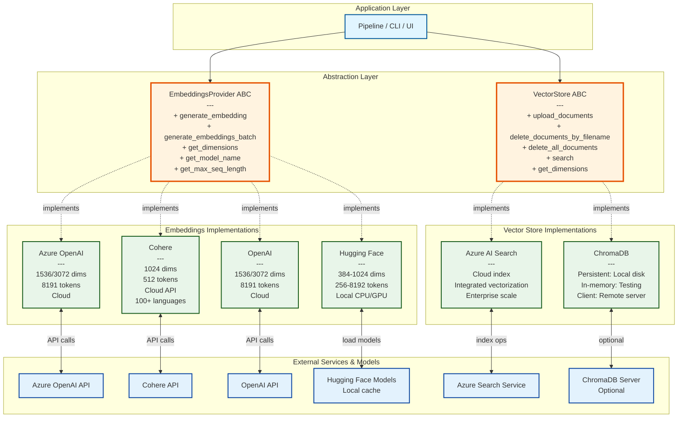
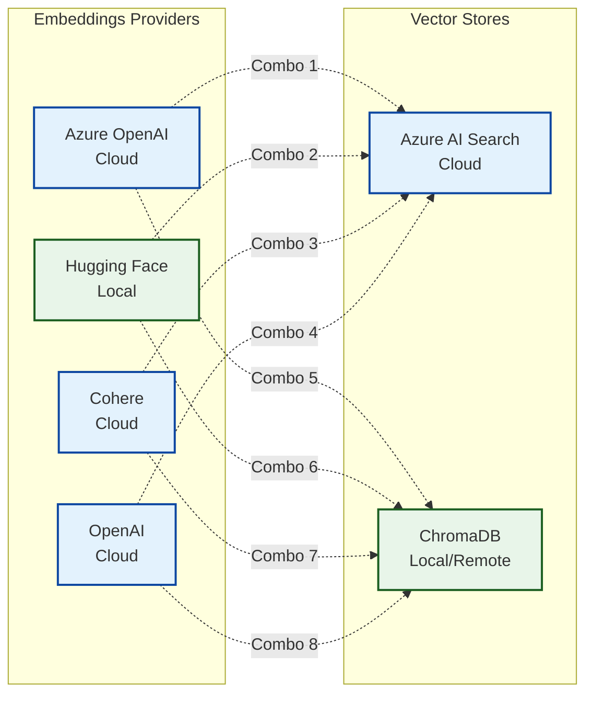
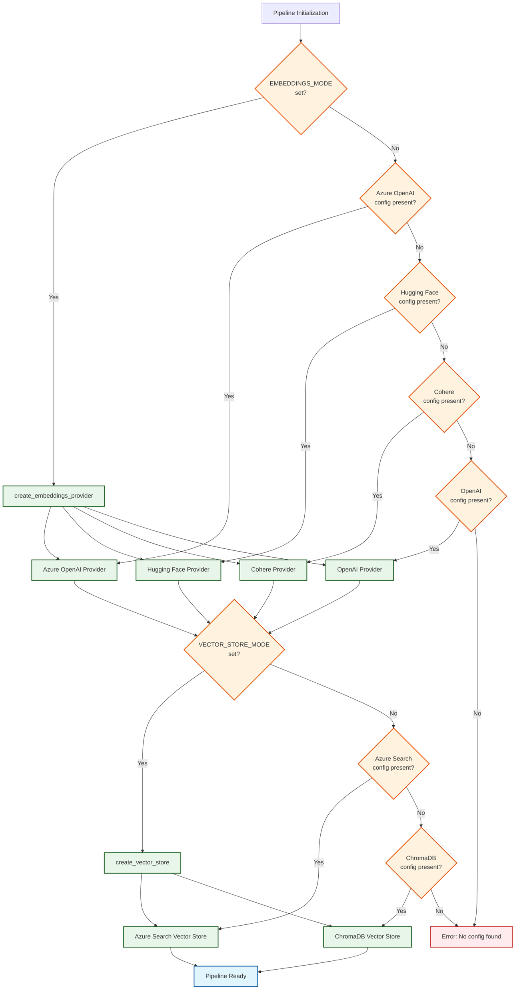

# Pluggable Architecture

## Overview

Ingest-o-bot implements a fully pluggable architecture that allows you to mix and match different embeddings providers and vector stores. This enables scenarios from fully cloud-based to completely offline processing, with flexible cost optimization.

## Architecture Layers



## Supported Combinations

### All 8 Combinations (4 Embeddings × 2 Vector Stores)



### Combination Details

| # | Embeddings | Vector Store | Cloud | Offline | Use Case |
|---|------------|--------------|-------|---------|----------|
| 1 | Azure OpenAI | Azure Search | Yes | No | **Production Cloud** (Default)<br/>Enterprise-grade, fully managed |
| 2 | Hugging Face | Azure Search | Partial | No | **Hybrid Cost Savings**<br/>Free embeddings, cloud storage |
| 3 | Cohere | Azure Search | Yes | No | **Multilingual Cloud**<br/>100+ languages, cloud storage |
| 4 | OpenAI | Azure Search | Yes | No | **Native OpenAI**<br/>OpenAI embeddings, Azure storage |
| 5 | Azure OpenAI | ChromaDB | Partial | No | **Local Storage**<br/>Cloud embeddings, local database |
| 6 | Hugging Face | ChromaDB | No | Yes | **Fully Offline**<br/>Zero cloud dependencies |
| 7 | Cohere | ChromaDB | Partial | No | **Multilingual Local**<br/>Cloud embeddings, local storage |
| 8 | OpenAI | ChromaDB | Partial | No | **OpenAI + Local**<br/>OpenAI embeddings, local storage |

## Component Specifications

### Embeddings Providers

#### Azure OpenAI Provider
```yaml
Class: AzureOpenAIProvider
Module: embeddings_providers.azure_openai_provider
Models:
  - text-embedding-ada-002 (1536 dims)
  - text-embedding-3-small (1536 dims)
  - text-embedding-3-large (3072 dims)
Max Tokens: 8191
Execution: Cloud API
Cost: Pay per 1K tokens
Dependencies:
  - openai (Azure)
  - azure-identity
Environment Variables:
  - AZURE_OPENAI_ENDPOINT
  - AZURE_OPENAI_EMBEDDING_DEPLOYMENT
  - AZURE_OPENAI_API_KEY (or managed identity)
```

#### Hugging Face Provider
```yaml
Class: HuggingFaceProvider
Module: embeddings_providers.huggingface_provider
Models:
  - all-MiniLM-L6-v2 (384 dims, 256 tokens)
  - jina-embeddings-v2-base-en (768 dims, 8192 tokens) [Default]
  - multilingual-e5-large (1024 dims, 512 tokens)
  - BGE-large (1024 dims, 512 tokens)
Execution: Local (CPU/GPU/MPS)
Cost: Free (compute only)
Dependencies:
  - sentence-transformers
  - torch
Model Cache: ~/.cache/huggingface/
Environment Variables:
  - HUGGINGFACE_MODEL_NAME (default: jina-embeddings-v2-base-en)
  - HUGGINGFACE_DEVICE (cpu/cuda/mps)
```

#### Cohere Provider
```yaml
Class: CohereProvider
Module: embeddings_providers.cohere_provider
Models:
  - embed-multilingual-v3.0 (1024 dims)
Max Tokens: 512
Languages: 100+
Execution: Cloud API
Cost: Pay per 1M tokens
Batch Size: 96 texts per request
Dependencies:
  - cohere
Environment Variables:
  - COHERE_API_KEY
  - COHERE_MODEL (default: embed-multilingual-v3.0)
```

#### OpenAI Provider
```yaml
Class: OpenAIProvider
Module: embeddings_providers.openai_provider
Models:
  - text-embedding-3-small (1536 dims)
  - text-embedding-3-large (3072 dims)
  - text-embedding-ada-002 (1536 dims)
Max Tokens: 8191
Execution: Cloud API (non-Azure)
Cost: Pay per 1K tokens
Dependencies:
  - openai
Environment Variables:
  - OPENAI_API_KEY
  - OPENAI_EMBEDDING_MODEL
```

### Vector Stores

#### Azure AI Search Vector Store
```yaml
Class: AzureSearchVectorStore
Module: vector_stores.azure_search_vector_store
Features:
  - Integrated vectorization (server-side)
  - Client-side vectorization
  - Semantic ranking
  - Hybrid search (vector + keyword)
  - Scoring profiles
Scale: Enterprise (billions of vectors)
Batch Size: 1000 documents
Dependencies:
  - azure-search-documents
  - azure-identity
Environment Variables:
  - AZURE_SEARCH_SERVICE
  - AZURE_SEARCH_INDEX
  - AZURE_SEARCH_API_KEY (or managed identity)
  - INTEGRATED_VECTORIZATION (true/false)
```

#### ChromaDB Vector Store
```yaml
Class: ChromaDBVectorStore
Module: vector_stores.chromadb_vector_store
Modes:
  - Persistent: Local disk storage
  - In-memory: Ephemeral (testing)
  - Client/Server: Remote ChromaDB
Features:
  - Metadata filtering
  - Similarity search
  - HNSW indexing
  - Cosine/L2/IP distance metrics
Scale: Small to medium (millions of vectors)
Batch Size: Configurable (default: 100)
Dependencies:
  - chromadb
Environment Variables:
  - CHROMADB_PERSIST_DIR (persistent mode)
  - CHROMADB_IN_MEMORY=true (in-memory mode)
  - CHROMADB_HOST/PORT/AUTH (client mode)
```

## Configuration Examples

### 1. Production Cloud (Default)
```bash
# Azure OpenAI + Azure Search
AZURE_OPENAI_ENDPOINT=https://your-openai.openai.azure.com
AZURE_OPENAI_EMBEDDING_DEPLOYMENT=text-embedding-ada-002
AZURE_SEARCH_SERVICE=your-search-service
AZURE_SEARCH_INDEX=documents
```

### 2. Fully Offline
```bash
# Hugging Face + ChromaDB
VECTOR_STORE_MODE=chromadb
CHROMADB_PERSIST_DIR=./chroma_db
EMBEDDINGS_MODE=huggingface
HUGGINGFACE_MODEL_NAME=jinaai/jina-embeddings-v2-base-en
```

### 3. Cost Optimized
```bash
# Hugging Face (free) + Azure Search
EMBEDDINGS_MODE=huggingface
HUGGINGFACE_MODEL_NAME=jinaai/jina-embeddings-v2-base-en
AZURE_SEARCH_SERVICE=your-search-service
AZURE_SEARCH_INDEX=documents
```

### 4. Multilingual
```bash
# Cohere (100+ languages) + Azure Search
EMBEDDINGS_MODE=cohere
COHERE_API_KEY=your-cohere-key
AZURE_SEARCH_SERVICE=your-search-service
AZURE_SEARCH_INDEX=documents
```

### 5. Development/Testing
```bash
# Hugging Face + ChromaDB (in-memory)
VECTOR_STORE_MODE=chromadb
CHROMADB_IN_MEMORY=true
EMBEDDINGS_MODE=huggingface
HUGGINGFACE_MODEL_NAME=sentence-transformers/all-MiniLM-L6-v2
```

## Factory Pattern

### Auto-Detection Flow



## Extensibility

### Adding New Embeddings Provider

```python
# 1. Implement the ABC
from ingestor.embeddings_provider import EmbeddingsProvider

class MyEmbeddingsProvider(EmbeddingsProvider):
    async def generate_embedding(self, text: str) -> list[float]:
        # Your implementation
        pass

    async def generate_embeddings_batch(self, texts: list[str]) -> list[list[float]]:
        # Your implementation
        pass

    def get_dimensions(self) -> int:
        return 768  # Your model dimensions

    def get_model_name(self) -> str:
        return "my-model-name"

    def get_max_seq_length(self) -> int:
        return 512  # Your model max tokens

# 2. Add to factory function in embeddings_provider.py
def create_embeddings_provider(config: PipelineConfig) -> EmbeddingsProvider:
    # Add your detection logic
    if config.my_provider_config:
        return MyEmbeddingsProvider(config)
    # ... existing logic
```

### Adding New Vector Store

```python
# 1. Implement the ABC
from ingestor.vector_store import VectorStore

class MyVectorStore(VectorStore):
    async def upload_documents(self, chunk_docs, include_embeddings=True) -> int:
        # Your implementation
        pass

    async def delete_documents_by_filename(self, filename: str) -> int:
        # Your implementation
        pass

    async def delete_all_documents(self) -> int:
        # Your implementation
        pass

    async def search(self, query: str, top_k: int = 10, filters=None) -> list[dict]:
        # Your implementation
        pass

    def get_dimensions(self) -> int:
        return self.dimensions

# 2. Add to factory function in vector_store.py
def create_vector_store(config: PipelineConfig, embeddings_provider) -> VectorStore:
    # Add your detection logic
    if config.my_store_config:
        return MyVectorStore(config)
    # ... existing logic
```

## Benefits

### Flexibility
- Choose the best provider for your use case
- Switch providers without code changes
- Test locally before deploying to cloud

### Cost Optimization
- Use free local models for development
- Mix free embeddings with cloud storage
- Scale embeddings independently from storage

### Data Privacy
- Process sensitive documents fully offline
- Keep embeddings on-premises
- Control data residency

### Multilingual Support
- Use Cohere for 100+ languages
- Switch models based on content language
- Optimize for specific language families

### Development Speed
- Rapid iteration with local setup
- No cloud dependencies for testing
- Fast model switching

## Performance Considerations

### Embeddings Performance

| Provider | Latency | Throughput | Cost |
|----------|---------|------------|------|
| Azure OpenAI | 50-200ms | High (concurrent) | $0.0001/1K tokens |
| Hugging Face | 10-100ms | Medium (GPU) / Low (CPU) | Free (compute) |
| Cohere | 50-150ms | Very High (batch 96) | $0.0001/1K tokens |
| OpenAI | 50-200ms | High (concurrent) | $0.0001/1K tokens |

### Vector Store Performance

| Store | Write Speed | Search Speed | Scale | Cost |
|-------|-------------|--------------|-------|------|
| Azure Search | Very High | Very High | Billions | $$$ per month |
| ChromaDB | High | High | Millions | Free (storage) |

## Related Documentation

- [Vector Stores Guide](../guides/VECTOR_STORES_GUIDE.md) - Detailed vector store comparison
- [Embeddings Providers Guide](../guides/EMBEDDINGS_PROVIDERS_GUIDE.md) - Detailed embeddings comparison
- [Configuration Examples](../guides/CONFIGURATION_EXAMPLES.md) - All configuration scenarios
- [High-Level Architecture](01_HIGH_LEVEL_ARCHITECTURE.md) - System overview
- [Component Interactions](02_COMPONENT_INTERACTIONS.md) - Component relationships
- [Data Flow](03_DATA_FLOW.md) - End-to-end processing

## Examples

See the [examples directory](../../examples/) for working code:
- `offline_chromadb_huggingface.py` - Fully offline setup
- `azure_search_cohere.py` - Cloud hybrid setup
- `notebooks/09_pluggable_architecture.ipynb` - Interactive tutorial
