# Sequence Diagram: Configuration Validation

## Pre-Check Validation Flow

This sequence diagram shows the step-by-step flow of the validation workflow, which validates configuration and environment before running the pipeline.

```mermaid
sequenceDiagram
    actor User
    participant CLI as CLI/Library
    participant Pipeline as Pipeline
    participant Validator as ConfigValidator
    participant Config as PipelineConfig
    participant InputSrc as InputSource
    participant ArtStore as ArtifactStorage
    participant AzDI as Azure Document<br/>Intelligence
    participant AzOAI as Azure OpenAI
    participant AzSearch as Azure AI Search
    participant AzBlob as Azure Blob Storage
    participant PyEnv as Python Environment

    %% Initialization
    User->>CLI: Run validation<br/>(--validate)
    CLI->>Config: Load configuration<br/>from .env
    Config-->>CLI: PipelineConfig object
    CLI->>Pipeline: Create Pipeline(config, validate_only=True)
    Note over Pipeline: validate_only flag set

    %% Start validation
    CLI->>Pipeline: run()
    Pipeline->>Validator: Create ConfigValidator(config)
    Pipeline->>Validator: validate_all()

    %% Phase 1: Python Dependencies
    Validator->>PyEnv: Check required libraries
    PyEnv-->>Validator: Libraries installed/missing
    alt Missing required libraries
        Validator->>Validator: _add_failure("Python Dependencies")
    end

    %% Phase 2: Input Source Validation
    Validator->>InputSrc: Create InputSource(config)

    alt Local input mode
        InputSrc->>InputSrc: Check local path exists
        InputSrc->>InputSrc: Check files match glob
        InputSrc-->>Validator: Files found / Not found
    else Blob input mode
        InputSrc->>AzBlob: Test blob container access
        AzBlob-->>InputSrc: Container accessible / Error
        InputSrc-->>Validator: Container valid / Invalid
    end

    alt Input validation fails
        Validator->>Validator: _add_failure("Input Source")
    end

    %% Phase 3: Artifact Storage Validation
    Validator->>ArtStore: Create ArtifactStorage(config)

    alt Local artifact storage
        ArtStore->>ArtStore: Check directory exists
        ArtStore->>ArtStore: Test write permissions
        ArtStore-->>Validator: Writable / Not writable
    else Blob artifact storage
        ArtStore->>AzBlob: Test container access
        AzBlob-->>ArtStore: Container accessible / Error
        ArtStore->>AzBlob: Test write permissions
        AzBlob-->>ArtStore: Writable / Not writable
        ArtStore-->>Validator: Container valid / Invalid
    end

    alt Artifact storage validation fails
        Validator->>Validator: _add_failure("Artifact Storage")
    end

    %% Phase 4: Document Extraction Validation (environment-aware)
    alt Azure DI configured
        Validator->>Config: Check DI endpoint/credentials
        Config-->>Validator: Endpoint/key present / Missing

        alt Credentials present
            Validator->>AzDI: Test API connection
            Note over Validator,AzDI: Simple API call to verify
            AzDI-->>Validator: Connection OK / Failed
        end

        alt DI validation fails
            Validator->>Validator: _add_failure("Azure Document Intelligence")
        end
    else MarkItDown mode
        Note over Validator: Skip Azure DI validation<br/>(not needed in this mode)
    end

    alt Office extractor validation
        Validator->>PyEnv: Check markitdown installed
        PyEnv-->>Validator: Installed / Not installed

        alt markitdown not installed AND no Azure DI
            Validator->>Validator: _add_failure("Office Extractor")
        end
    end

    %% Phase 5: Embeddings Validation (environment-aware)
    alt Client-side embeddings mode
        Validator->>Config: Check embeddings provider config

        alt Azure OpenAI embeddings
            Config-->>Validator: Endpoint/key/deployment
            Validator->>AzOAI: Test embeddings API
            Note over Validator,AzOAI: Generate test embedding
            AzOAI-->>Validator: Embedding generated / Error
        else Hugging Face embeddings
            Validator->>PyEnv: Check sentence-transformers
            PyEnv-->>Validator: Installed / Not installed
            Validator->>Validator: Test model loading
        else Cohere embeddings
            Config-->>Validator: API key
            Validator->>Validator: Test Cohere API
        else OpenAI embeddings
            Config-->>Validator: API key
            Validator->>Validator: Test OpenAI API
        end

        alt Embeddings validation fails
            Validator->>Validator: _add_failure("Embeddings Provider")
        end
    else Integrated vectorization mode
        Note over Validator: Skip embeddings validation<br/>(server-side vectorization)
    end

    %% Phase 6: Vector Store Validation
    Validator->>Config: Check vector store config

    alt Azure AI Search
        Config-->>Validator: Service/index/key
        Validator->>AzSearch: Test service connection
        AzSearch-->>Validator: Connection OK / Failed

        alt Connection OK
            Validator->>AzSearch: Check index exists
            AzSearch-->>Validator: Index found / Not found
        end

        alt Index not found
            Validator->>Validator: _add_warning("Index does not exist")
            Note over Validator: Suggest using --setup-index
        end
    else ChromaDB
        Validator->>Config: Check ChromaDB settings
        Validator->>Validator: Test ChromaDB initialization
    end

    alt Vector store validation fails
        Validator->>Validator: _add_failure("Vector Store")
    end

    %% Phase 7: Media Describer Validation (environment-aware)
    alt Media describer enabled
        Validator->>Config: Check media describer config

        alt GPT-4o mode
            Config-->>Validator: GPT-4o deployment
            Validator->>AzOAI: Test GPT-4o Vision API
            AzOAI-->>Validator: API OK / Error
        else Content Understanding mode
            Config-->>Validator: Content Understanding config
            Validator->>AzDI: Test Content Understanding
            AzDI-->>Validator: API OK / Error
        end

        alt Media describer validation fails
            Validator->>Validator: _add_failure("Media Describer")
        end
    else Media describer disabled
        Note over Validator: Skip media describer validation<br/>(feature not enabled)
    end

    %% Compile results
    Validator->>Validator: Compile validation results
    Validator-->>Pipeline: ValidationResult<br/>(success/failures/warnings)

    alt Validation passed
        Pipeline->>Pipeline: Log success summary
        Pipeline-->>CLI: Validation successful
        CLI-->>User: ✓ All checks passed<br/>Ready to run pipeline
    else Validation failed
        Pipeline->>Pipeline: Log failures and warnings
        Pipeline->>Pipeline: Format error messages
        Pipeline-->>CLI: Validation failed with errors
        CLI-->>User: ✗ Validation failed:<br/>- Error 1 (with fix hint)<br/>- Error 2 (with fix hint)<br/>⚠ Warnings:<br/>- Warning 1
    end
```



## Validation Workflow Breakdown

### Phase 1: Python Dependencies
**Purpose:** Ensure required Python libraries are installed

**Checks:**
- Core dependencies (azure-ai-documentintelligence, azure-search-documents, etc.)
- Optional dependencies based on configuration (sentence-transformers, cohere, etc.)

**Failure Example:**
```
❌ Python Dependencies
   Missing library: azure-ai-documentintelligence
   Fix: pip install azure-ai-documentintelligence
```

### Phase 2: Input Source
**Purpose:** Validate input source configuration and accessibility

**Environment-Aware Checks:**
- **Local Mode**: Check path exists, files match glob pattern
- **Blob Mode**: Test container connection, verify credentials

**Failure Examples:**
```
❌ Input Source
   Local path does not exist: /data/documents
   Fix: Create directory or update AZURE_LOCAL_GLOB path

❌ Input Source
   Cannot access blob container: input-documents
   Fix: Check AZURE_STORAGE_ACCOUNT and AZURE_STORAGE_KEY
```

### Phase 3: Artifact Storage
**Purpose:** Validate artifact storage configuration and write permissions

**Environment-Aware Checks:**
- **Local Storage**: Directory exists and writable
- **Blob Storage**: Container accessible and writable

**Failure Examples:**
```
❌ Artifact Storage
   Local directory not writable: /artifacts
   Fix: Check directory permissions or set AZURE_ARTIFACTS_OUTPUT_DIR

❌ Artifact Storage
   Cannot write to blob container: artifacts
   Fix: Check storage credentials and container exists
```

### Phase 4: Document Extraction
**Purpose:** Validate document extraction configuration

**Environment-Aware Checks:**
- **Azure DI Mode**: Endpoint/credentials configured, API accessible
- **MarkItDown Mode**: Library installed (skips Azure DI validation)
- **Office Extractor**: Either MarkItDown OR Azure DI available

**Failure Examples:**
```
❌ Azure Document Intelligence
   Endpoint not configured
   Fix: Set AZURE_DI_ENDPOINT environment variable

❌ Office Extractor
   Neither MarkItDown nor Azure DI configured
   Fix: Install markitdown OR configure Azure DI
```

### Phase 5: Embeddings Provider
**Purpose:** Validate embeddings configuration (client-side only)

**Environment-Aware Checks:**
- **Integrated Vectorization**: Skip validation (server-side)
- **Azure OpenAI**: Endpoint/deployment configured, API accessible
- **Hugging Face**: sentence-transformers installed, model loadable
- **Cohere**: API key configured, API accessible
- **OpenAI**: API key configured, API accessible

**Failure Examples:**
```
❌ Embeddings Provider (Azure OpenAI)
   Deployment not configured
   Fix: Set AZURE_OPENAI_EMBEDDING_DEPLOYMENT

❌ Embeddings Provider (Hugging Face)
   sentence-transformers not installed
   Fix: pip install sentence-transformers
```

### Phase 6: Vector Store
**Purpose:** Validate vector store configuration and connectivity

**Checks:**
- **Azure AI Search**: Service connection, index exists (or warning)
- **ChromaDB**: Library installed, initialization successful

**Warning Example:**
```
⚠ Azure AI Search Index
   Index 'documents' does not exist
   Suggestion: Run with --setup-index to create index
```

**Failure Examples:**
```
❌ Azure AI Search
   Cannot connect to service: my-search.search.windows.net
   Fix: Check AZURE_SEARCH_SERVICE and AZURE_SEARCH_KEY

❌ ChromaDB
   ChromaDB library not installed
   Fix: pip install chromadb
```

### Phase 7: Media Describer (Optional)
**Purpose:** Validate media description configuration if enabled

**Environment-Aware Checks:**
- **Disabled**: Skip validation entirely
- **GPT-4o Mode**: Deployment configured, Vision API accessible
- **Content Understanding**: Azure DI Content Understanding configured

**Failure Examples:**
```
❌ Media Describer (GPT-4o)
   GPT-4o deployment not configured
   Fix: Set AZURE_OPENAI_CHAT_DEPLOYMENT or disable media describer

❌ Media Describer (Content Understanding)
   Content Understanding not available in region
   Fix: Use GPT-4o mode or disable media describer
```

## Key Principles

### 1. Environment-Aware Validation
**Only validates what's configured and used:**
- MarkItDown mode → Skips Azure DI
- Integrated vectorization → Skips embeddings provider
- Media describer disabled → Skips media validation

### 2. Helpful Error Messages
**Each failure includes:**
- Component name
- Specific problem
- Actionable fix hint with commands/settings

### 3. Warnings vs Failures
**Failures:** Block pipeline execution
**Warnings:** Inform user but allow execution

**Example Warning:** Index doesn't exist (suggest --setup-index)

### 4. Early Detection
**Catches configuration problems before:**
- Starting expensive operations
- Processing documents
- Making API calls

## Usage Patterns

### Standalone Validation
```bash
# Validate configuration
python -m ingestor.cli --validate

# Validate then run if successful
python -m ingestor.cli --validate && python -m ingestor.cli --glob "data/*.pdf"
```

### Programmatic Validation
```python
from ingestor.config import PipelineConfig
from ingestor.pipeline import Pipeline

config = PipelineConfig.from_env()
pipeline = Pipeline(config, validate_only=True)

try:
    await pipeline.run()
    print("✓ Validation passed")
except RuntimeError as e:
    print(f"✗ Validation failed: {e}")
```

### Validation Script
```bash
# Standalone validation script
python scripts/utils/validate_config.py
```

## Related Documentation

- [Validation Guide](../guides/VALIDATION.md) - User-facing validation guide
- [Validation Reference](../reference/validation-reference.md) - Technical validation reference
- [Configuration Guide](../guides/CONFIGURATION.md) - Configuration options
- [Environment Variables](../reference/12_ENVIRONMENT_VARIABLES.md) - Complete environment reference

---

**Last Updated:** February 13, 2026
**Mermaid Version:** Compatible with GitHub Markdown
